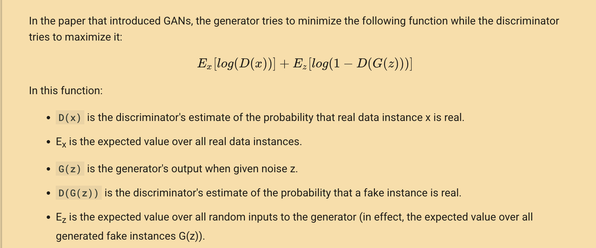

# Generative and Probabilistic Models (08 Hours)

## Overview

**1. Overview of generative models and their importance in AI**  
Generative models are machine learning models that learn the underlying distribution of data and can generate new data samples similar to the training data. They are important in AI for tasks like data augmentation, unsupervised learning, image and text generation, and anomaly detection.

**2. Fundamentals of Probability theory and generative modeling**  
Probability theory provides the foundation for generative modeling, involving concepts like random variables, probability distributions, conditional probability, and Bayes' theorem. Generative models use these principles to model how data is generated and to sample new data points.

## Introduction to GANs, VAEs and other generative models

**Generative models** are a class of machine learning models that can generate new data samples similar to the data they were trained on. They learn the underlying patterns or distribution of the training data and use this knowledge to create new, realistic data points.

### 1. Generative Adversarial Networks (GANs)
- **What are GANs?**  
  GANs are a type of neural network architecture introduced by Ian Goodfellow in 2014. They consist of two main parts: a generator and a discriminator.
- **How do they work?**  
  - The **generator** tries to create fake data that looks like real data.
  - The **discriminator** tries to tell the difference between real data (from the training set) and fake data (from the generator).
  - Both networks are trained together in a game-like setup: the generator gets better at making realistic data, and the discriminator gets better at spotting fakes.
- **Applications:**  
  GANs are used for generating realistic images, creating art, image-to-image translation, and even generating music or text.

### 2. Variational Autoencoders (VAEs)
- **What are VAEs?**  
are generative models in machine learning (ML) that create new data similar to the input they are trained on. Along with data generation they also perform common autoencoder tasks like denoising. Like all autoencoders VAEs consist of:

- Encoder: Learns important patterns (latent variables) from input data.
- Decoder: It uses those latent variables to reconstruct the input.

Unlike traditional autoencoders that encode a `fixed representation` VAEs learn a `continuous probabilistic representation of latent space`. This allows them to reconstruct input data accurately and generate new data samples that resemble the original input.
- **Applications:**  
  VAEs are used for generating new images, data denoising, and learning meaningful data representations.

### 3. Other Generative Models
- **Autoregressive Models:**  
  Autoregressive models are a class of generative models that generate data sequentially, where each new element is conditioned on previously generated elements. This sequential generation process creates a natural ordering in the data, making them particularly effective for time-series data, images, and audio.

  Key characteristics:
  - **Sequential Generation**: Each element is generated one at a time, building upon previously generated elements
  - **Conditional Probability**: Uses conditional probability distributions to model dependencies between elements
  - **Explicit Likelihood**: Can compute exact likelihood of the data, making them easier to train than GANs
  - **Bidirectional Context**: Can incorporate both past and future context in some implementations

  Notable examples:
  - **PixelRNN/PixelCNN**: Generate images pixel by pixel, where each pixel's value depends on previously generated pixels
  - **WaveNet**: Generates audio samples sequentially, capturing long-range dependencies in audio signals
  - **GPT (Generative Pre-trained Transformer)**: Uses autoregressive generation for text, predicting the next word based on previous words
  - **MuseNet**: Generates music by predicting the next note based on the musical context

  Advantages:
  - Provide explicit probability distributions
  - Can generate high-quality, coherent outputs
  - Well-suited for sequential data
  - Training stability compared to GANs

  Limitations:
  - Sequential generation can be slow
  - May struggle with capturing long-range dependencies
  - Generation time scales linearly with output size
- **Flow-based Models:**  
  These models learn an invertible mapping between data and a simple distribution (like a Gaussian), allowing exact likelihood computation and easy sampling.
- **Energy-based Models:**  
  These models assign an "energy" to each possible data point and generate data by finding points with low energy.

**Summary:**  
GANs and VAEs are two of the most popular generative models, each with their own strengths. GANs are great for generating sharp, realistic images, while VAEs are good for learning structured, continuous representations of data. Other generative models offer different trade-offs and are used in various applications.

**4. Significance of generative models**  
Generative models are significant because they enable the creation of new, realistic data, support unsupervised and semi-supervised learning, help with data imputation and denoising, and power creative AI applications like art and text generation.

**5. Challenges with generative models**  

1. **Training Instability**
   - Particularly problematic in GANs where the generator and discriminator must maintain a delicate balance
   - Can lead to oscillations in training where neither network makes progress
   - Often requires careful tuning of learning rates and architecture modifications
   - May result in complete training failure if not properly managed

2. **Mode Collapse**
   - Generator produces a limited variety of outputs, failing to capture the full diversity of the training data
   - Often generates similar or identical samples despite different input noise
   - Can occur when the generator finds a few successful "tricks" that fool the discriminator
   - Particularly challenging in complex datasets with multiple distinct modes

3. **High Computational Requirements**

4. **Evaluation Difficulties**
   - No standardized metrics for assessing generated data quality
   - Subjective nature of evaluating generated content (especially in creative domains)
   - Traditional metrics may not capture important aspects of generation quality
   - Need for both quantitative and qualitative evaluation methods

5. **Hyperparameter Sensitivity**
   - Performance heavily dependent on careful tuning of numerous parameters
   - Small changes in hyperparameters can lead to significant performance differences
   - Requires extensive experimentation and domain expertise
   - Different architectures may need different optimal parameter settings

## Probabilistic Models

**6. Gaussian Mixture Models (GMMs)**  
A Gaussian mixture model is a `soft clustering technique (where data points can belong to multiple clusters with a certain probability. This provides a more flexible and nuanced way to handle clusters, especially when points are close to multiple centroids. K-means is a clustering algorithm that assigns each data point to one cluster based on the closest centroid. It’s a hard clustering method, meaning each point belongs to only one cluster with no uncertainty.` used in unsupervised learning to determine the probability that a given data point belongs to a cluster. It’s composed of several Gaussians, each identified by `k ∈ {1,…, K}`, where `K` is the number of clusters in a data set. 
Gaussian Mixture Models (GMMs) are `probabilistic models` that represent the probability distribution of data as a weighted sum of multiple Gaussian (normal) distributions. Each Gaussian component in the mixture has its own:
  - Mean (μ): Center of the Gaussian distribution.
  - Covariance (Σ): Spread or shape of the distribution.
  - Mixing Coefficient (π): Probability of a data point belonging to a particular Gaussian.

The probability of data point ​ coming from Gaussian cluster k is expressed as:

Key aspects of GMMs:
- **Model Structure**: A GMM combines K Gaussian distributions, each with its own parameters (mean μk and covariance matrix Σk) and mixing weight πk
- **Probability Density**: The overall probability density is the weighted sum of individual Gaussian densities
- **Applications**: 
  - Clustering: GMMs can identify natural groupings in data
  - Density Estimation: They can model the underlying probability distribution of data
  - Feature Extraction: Used in dimensionality reduction techniques
  - Anomaly Detection: Can identify data points that don't fit the learned distribution

**Training Process**:
The Expectation-Maximization (EM) algorithm is used to train GMMs through two alternating steps:
1. **E-step**: Calculate the probability of each data point belonging to each Gaussian component
2. **M-step**: Update the parameters (means, covariances, and mixing weights) to maximize the likelihood

**Advantages**:
- Can model complex, non-elliptical clusters
- Provides soft clustering assignments
- Incorporates uncertainty in the model
- Can capture correlations between features

**Limitations**:
- Requires specifying the number of components (Gaussians) beforehand
- Assumes data follows a Gaussian distribution
- Can be sensitive to initialization
- May converge to local optima

**7. Hidden Markov Models (HMMs)**  
It is an statistical model that is used to describe the probabilistic relationship between a sequence of observations and a sequence of hidden states. Hidden Markov Models (HMMs) are powerful statistical models that represent systems where the underlying process is assumed to be a Markov process with unobservable (hidden) states. The model consists of two key components:

1. **Hidden States**: 
   - Represent the underlying, unobservable states of the system
   - Follow the Markov property, meaning the probability of transitioning to a new state depends only on the current state
   - Each state has an associated probability distribution for generating observable outputs

2. **Observable Outputs**:
   - The visible data generated by the hidden states
   - Each hidden state can produce different outputs with specific probabilities
   - The sequence of observations provides indirect information about the hidden states

Working:

- Step 1: Define the state space and observation space: The state space is the set of all possible hidden states, and the observation space is the set of all possible observations.

- Step 2: Define the initial state distribution: This is the probability distribution over the initial state.

- Step 3: Define the state transition probabilities: These are the probabilities of transitioning from one state to another. This forms the transition matrix, which describes the probability of moving from one state to another.

- Step 4: Define the observation likelihoods: These are the probabilities of generating each observation from each state. This forms the emission matrix, which describes the probability of generating each observation from each state.

`NOTE: Transition Probabilities: Likelihood of moving from one hidden state to another. Emission Probabilities: Likelihood of generating an observation from a hidden state.`

- Training the Model:
Parameters (transition and emission probabilities) are estimated using algorithms like Baum-Welch or Forward-Backward. This is done by iteratively updating the parameters until convergence.

- Decoding Hidden States:
Given observed data, the Viterbi algorithm finds the most probable sequence of hidden states.
This helps in predicting future observations or classifying sequences.

- Evaluation:
Performance is assessed using metrics like accuracy, precision, recall, or F1 score.

Key Applications:
- Speech Recognition: Modeling phonemes and words in audio signals
- Handwriting Recognition: Converting written text into digital format
- Natural Language Processing: Part-of-speech tagging and named entity recognition
- Bioinformatics: DNA sequence analysis and protein structure prediction
- Time Series Analysis: Modeling temporal patterns in financial or sensor data

The model is characterized by three fundamental problems:
1. **Evaluation**: Computing the probability of an observed sequence
2. **Decoding**: Finding the most likely sequence of hidden states
3. **Learning**: Determining the model parameters from training data

HMMs are particularly valuable when dealing with sequential data where the underlying process is not directly observable but can be inferred from observable outputs.

**8. Bayesian Networks**  
Bayesian Networks are directed acyclic graphs where nodes represent random variables and edges represent conditional dependencies. They are used for probabilistic inference, reasoning under uncertainty, and decision making.

**9. Markov Random Field (MRFs)**  
MRFs are undirected graphical models representing the joint distribution of a set of variables with Markov properties. They are used in image processing and computer vision to model contextual dependencies.

**10. Probabilistic Graphical Model**  
Probabilistic Graphical Models (PGMs) are frameworks for representing complex distributions using graphs. They include Bayesian Networks (directed) and Markov Random Fields (undirected), enabling efficient representation and inference in high-dimensional probability distributions.

# Generative Adversarial Networks (07 Hours)

## Core Concepts

### 1. Generative Adversarial Networks (GANs) architecture
GANs consist of two neural networks: a **generator** and a **discriminator**. These two networks are trained together in a competitive process:
- The **generator** creates fake data that tries to mimic real data.
- The **discriminator** evaluates data and tries to distinguish between real (from the dataset) and fake (from the generator) data.
- Both networks improve through this competition, resulting in the generator producing increasingly realistic data.

### 2. The discriminator model and generator model
- **Generator:**  
  Takes random noise as input and transforms it into data that resembles the real dataset (e.g., images).
- **Discriminator:**  
  Takes data as input and outputs a probability indicating whether the data is real or fake.
- The generator's goal is to fool the discriminator, while the discriminator's goal is to correctly identify real vs. fake data.

### 3. Architecture and Training GANs
- **Architecture:**  
  Both the generator and discriminator are usually deep neural networks (often convolutional for images).
- **Training:**  
  - The generator and discriminator are trained in turns.
  - The discriminator is trained to maximize the probability of correctly classifying real and fake data.
  - The generator is trained to minimize the probability that the discriminator correctly identifies its outputs as fake.
  - This is a minimax game:  

  - Training continues until the generator produces data indistinguishable from real data.

### 4. Vanilla GAN Architecture
- The original GAN architecture is called "vanilla GAN."
- Both generator and discriminator are simple feedforward neural networks.
- The generator takes random noise and outputs data (e.g., an image).
- The discriminator takes data and outputs a single value (real or fake).
- Loss functions are based on binary cross-entropy.

## Advanced Topics

### 5. GAN variants and improvements

- **DCGAN (Deep Convolutional GAN):**  
  Deep Convolutional GANs, or DCGANs, are a variant of the standard GAN architecture that incorporate convolutional layers, which are particularly well-suited for image data. The primary innovation of DCGANs is the use of deep convolutional networks in both the generator and discriminator models, which enhances their ability to capture spatial hierarchies in images. 

  In a DCGAN, the generator network is designed to take a random noise vector as input and transform it through a series of convolutional layers, upsampling the data to produce a high-resolution image. `This process involves using transposed convolutional layers`, also known as `deconvolutional layers`, which `help in increasing the spatial dimensions of the data, effectively generating larger images from smaller input vectors`. The generator's architecture typically includes `batch normalization layers`, which help `stabilize the training process by normalizing the inputs to each layer`, and `activation functions like ReLU, which introduce non-linearity` and help in learning complex patterns.

  The discriminator in a DCGAN is a convolutional neural network that takes an image as input and processes it through several convolutional layers to output a probability score indicating whether the image is real or fake. The use of convolutional layers allows the discriminator to effectively learn and identify intricate features and patterns in the images, making it more adept at distinguishing between real and generated images. `Leaky ReLU is often used as the activation function in the discriminator to allow a small, non-zero gradient when the unit is not active, which helps in learning more robust features.`

  DCGANs have been particularly successful in generating high-quality images due to their ability to leverage the hierarchical feature learning capabilities of convolutional networks. They have been applied in various domains, including art generation, super-resolution, and even video generation, where the quality and realism of the generated content are crucial. The introduction of DCGANs marked a significant advancement in the field of generative models, providing a more stable and effective framework for training GANs on image data.

  ---
  
- **WGAN (Wasserstein GAN):**  
  The Wasserstein GAN, or WGAN, is an advanced variant of the traditional GAN architecture that `addresses some of the inherent challenges` in training GANs, particularly the issues of `training instability and mode collapse`. The key innovation in WGANs is the use of the `Wasserstein distance, also known as the Earth Mover's distance, as a new loss function. This distance measures the cost of transforming one probability distribution into another`, providing a more meaningful and smooth gradient for optimization compared to the Jensen-Shannon divergence used in standard GANs.

  The Wasserstein distance offers several advantages that contribute to more stable training. Firstly, `it provides a continuous and differentiable measure of the distance between the real and generated data distributions`, which helps in `maintaining a consistent gradient flow during training`. This is crucial because it prevents the generator from `receiving vanishing or exploding gradients`, a common problem in traditional GANs that can lead to training failure.

  `In WGANs, the discriminator is referred to as the "critic" because it no longer outputs a probability of the data being real or fake. Instead, it assigns a real-valued score to the input data, which reflects how real or fake the data is`. The generator's objective is to produce data that maximizes the critic's score, effectively `minimizing the Wasserstein distance between the real and generated data distributions.`

  Another significant modification in WGANs is the `use of weight clipping in the critic network`. This technique involves `constraining the weights of the critic to a fixed range, ensuring that the Lipschitz continuity condition required for the Wasserstein distance is satisfied`. However, weight clipping can sometimes lead to optimization issues, so alternative methods like gradient penalty have been proposed to enforce the Lipschitz constraint more effectively.

  Overall, WGANs have demonstrated improved training stability and convergence properties compared to traditional GANs. They are less sensitive to hyperparameter settings and can produce more diverse and high-quality outputs. The introduction of WGANs has significantly advanced the field of generative modeling, providing a robust framework for training GANs across various applications, including image generation, data augmentation, and more.

---

- **Conditional GAN (cGAN):**  
  Conditional Generative Adversarial Networks (cGANs) are an extension of the standard GAN architecture that allow for the generation of data conditioned on additional information, such as class labels or other auxiliary data. This conditioning enables the model to generate specific types of data based on the input conditions, making cGANs particularly useful in scenarios where control over the output is desired.

  `In a cGAN, both the generator and the discriminator are provided with extra information in addition to the usual inputs`. For instance, when generating images, the generator receives a random noise vector along with a label indicating the desired class of the image to be generated. This label could represent categories such as "cat," "dog," or "car," allowing the generator to produce images that belong to the specified class. `The discriminator, on the other hand, is tasked with distinguishing between real and fake images while also considering the class label`. It receives both the image and the corresponding label as input and learns to determine whether the image-label pair is real or generated.

  `The architecture of a cGAN involves modifying the input layers of both the generator and the discriminator to incorporate the conditional information. This is typically achieved by concatenating the label information with the noise vector in the generator and with the image data in the discriminator`. The networks then process these combined inputs through their respective layers, which may include convolutional layers, fully connected layers, and activation functions like ReLU or Leaky ReLU.

  The training process of a cGAN follows the adversarial framework of traditional GANs, where the generator aims to produce realistic data that matches the given condition, and the discriminator strives to accurately classify real versus fake data while considering the condition. `The loss functions used in cGANs are often based on binary cross-entropy, similar to standard GANs, but they are adapted to account for the conditional inputs.`

  cGANs have been successfully applied in various domains, including image-to-image translation, where they can transform images from one domain to another while preserving specific attributes. For example, cGANs can be used to convert sketches into colored images, generate images from text descriptions, or even create different styles of artwork based on a given style label. The ability to condition the output on specific inputs makes cGANs a powerful tool for tasks that require controlled and targeted data generation, enhancing their applicability in fields such as computer vision, art generation, and data augmentation.
  
- **CycleGAN:**  
  CycleGAN is a type of Generative Adversarial Network (GAN) designed for image-to-image translation tasks where paired training data is not available. Unlike traditional GANs that require paired examples of input and output images, CycleGAN can learn to translate between two different image domains using unpaired datasets. This is achieved through a cycle consistency loss, which ensures that an image translated from domain A to domain B and then back to domain A returns to its original form. 

  The architecture of CycleGAN consists of two generator networks and two discriminator networks. The first generator, G, translates images from domain A to domain B, while the second generator, F, translates images from domain B back to domain A. The discriminators, D_A and D_B, are used to distinguish between real images and those generated by G and F in domains A and B, respectively.

  The cycle consistency loss is a crucial component of CycleGAN, as it enforces the condition that if an image is translated to another domain and then back to the original domain, it should closely resemble the original image. This loss is defined as the sum of the differences between the original images and the twice-translated images. Additionally, adversarial losses are used to ensure that the generated images are indistinguishable from real images in their respective domains.

  CycleGAN has been successfully applied to various tasks, such as transforming photographs into paintings, converting images of horses into zebras, and vice versa, and even adapting the style of one artist to another. Its ability to perform image-to-image translation without the need for paired data makes it a powerful tool in scenarios where collecting such data is challenging or impossible.

### 6. Challenges

- **Training instability:**  
  GANs can be difficult to train; the generator and discriminator may not improve together, leading to poor results.
- **Model collapse (Mode collapse):**  
  The generator may produce limited types of outputs, lacking diversity.

### 7. Applications

- **Image synthesis:**  
  GANs are widely used to generate new, realistic images from random noise, leveraging their ability to learn complex data distributions and produce high-quality visual content.

- **Style transfer:**  
  GANs facilitate the transformation of an image's style, such as converting a photograph into a painting, by learning and applying the stylistic features of one image onto another while preserving the original content.

- **Other applications:**  
  Beyond image synthesis and style transfer, GANs are employed in data augmentation, enhancing image resolution (super-resolution), filling in missing parts of images (image inpainting), and various other creative and practical tasks.

# Variational Autoencoders (07 Hours)

### 1. Architecture and Training of VAEs
The general architecture of an autoencoder includes an encoder, decoder, and bottleneck layer.
- **Encoder:**
Input layer take raw input data. The hidden layers progressively reduce the dimensionality of the input, capturing important features and patterns. These layer compose the encoder.
- **Bottleneck layer:** `(latent space:  lower-dimensional representation of the input data)` is the final hidden layer, where the `dimensionality is significantly reduced`. This layer represents the compressed encoding of the input data.
- **Decoder:**
The hidden layers progressively increase the dimensionality and aim to reconstruct the original input. The output layer produces the reconstructed output, which ideally should be as close as possible to the input data.

- The loss function used during training is typically a `reconstruction loss`, which quantifies how well the autoencoder is able to reproduce the input data from its compressed representation. Two common types of reconstruction loss are `mean squared error (MSE)` and `binary cross-entropy`.

  - **Mean Squared Error (MSE):** This loss function is used for continuous data and calculates the average of the squares of the differences between the input data and the reconstructed output. Mathematically, it is expressed as:

    MSE = (1/n) * Σ(x - x̂)²

    where:
    - x is the original input data
    - x̂ is the reconstructed output
    - n is the number of data points
    - Σ represents the sum over all data points

    MSE penalizes larger errors more heavily, making it sensitive to outliers. It is suitable for tasks where the data is continuous and the goal is to minimize the average squared difference between the input and output.

  - **Binary Cross-Entropy:** This loss function is used for binary data and measures the difference between the true binary labels and the predicted probabilities. It is defined as:

    Binary Cross-Entropy = -(1/n) * Σ[x * log(x̂) + (1-x) * log(1-x̂)]

    where:
    - x is the true binary label (0 or 1)
    - x̂ is the predicted probability (between 0 and 1)
    - n is the number of data points
    - Σ represents the sum over all data points
    - log represents the natural logarithm

    Binary cross-entropy is effective for tasks where the data is binary or can be interpreted as probabilities, as it focuses on minimizing the difference between the predicted and actual binary outcomes.

- During training, the autoencoder learns to `minimize the reconstruction loss`, forcing the network to capture the most important features of the input data in the bottleneck layer.

### 2. Variational Autoencoders (VAEs) 
are generative models in machine learning (ML) that create new data similar to the input they are trained on. Along with data generation they also perform common autoencoder tasks like denoising. `Unlike traditional autoencoders that encode a fixed representation VAEs learn a continuous probabilistic representation of latent space.` This allows them to reconstruct input data accurately and generate new data samples that resemble the original input.

**Architecture of Variational Autoencoder:**
1. Encoder (Understanding the Input)
The encoder takes the input data like an image or text and tries to understand its most important features.
Instead of creating a fixed compressed version like a normal autoencoder it creates two things:
Mean (μ): A central value representing the data.
Standard Deviation (σ): It is a measure of how much the values can vary.
These two values define a range of possibilities instead of a single number.

2. Latent Space (Adding Some Randomness)
Instead of encoding input into a fixed number VAEs introduce randomness to create variations.
The model picks a point from the range to create different variations of the data.
This is what makes VAEs great for generating new slightly different but realistic data.

3. Decoder (Reconstructing or Creating New Data)
The decoder takes this sampled value and tries to reconstruct the original input.
Since the encoder creates a range of possibilities instead of a fixed number the decoder can generate new similar data instead of just memorizing the input.

**Mathematics behind Variational Autoencoder**

Variational autoencoder uses `KL-divergence` as its loss function the goal of this is to minimize the difference between a supposed distribution and original distribution of dataset, which is given by: (Suppose we have a distribution `z` and we want to generate the observation `x` from it.  In other words we want to calculate `p(z∣x)` )

# 3. Denoising Autoencoders `DAEs`: 
are a type of autoencoder specifically designed to make the `learned representations robust to noise`. They are trained to `reconstruct the original, clean input from a corrupted version`, effectively `forcing` the network to `focus on the most essential features` in the data.

### How Denoising Autoencoders Work:

- **Add Noise to Input:** During training, random noise (such as Gaussian noise or masking noise) is added to the input data. This corrupts the input while the output remains the original, clean data.
- **Reconstruction Objective:** The autoencoder then tries to reconstruct the original, noise-free input from this noisy version, minimizing the difference between the reconstructed output and the clean input.
- **Learning Robust Features:** By reconstructing the clean data from noisy input, the DAE learns features that are resilient to irrelevant variations, capturing important patterns and structures in the data.

### Benefits of Denoising Autoencoders

- **Noise Reduction:** DAEs are effective for removing noise from data, like enhancing low-quality images.
- **Feature Learning:** By ignoring noise, DAEs learn robust, high-quality features for downstream tasks (e.g., classification, clustering).
- **Anomaly Detection:** High reconstruction errors for unusual inputs make DAEs useful for identifying anomalies.

### Applications

- **Image Denoising:** DAEs are often used to clean up noisy images.
- **Speech Enhancement:** Improve speech quality by reducing background noise.
- **Anomaly Detection:** Detecting unusual patterns by comparing reconstruction errors for typical vs. anomalous data.

# 4. Sparse Autoencoders: 
are a type of autoencoder that introduces `sparsity constraints` on the hidden layer, `encouraging` the network to learn more `distinct, compressed representations` by activating `only a few neurons for each input`. This sparsity promotes learning of important features `without redundancy`, making sparse autoencoders especially useful for feature extraction.

### How Sparse Autoencoders Work

These `AE's` Enforce sparsity by adding a `regularization term to the loss function`, which `penalizes` the network `if too many neurons are active simultaneously`. This constraint `encourages` only a few neurons in the hidden layer `to respond strongly to each input`, thus learning distinct, critical features.

The `sparsity constraint` forces the autoencoder to only activate `specific neurons` in `response to distinctive features`, helping capture important aspects of the data.

### Applications

- **Image and Text Feature Extraction:** Identifies the key components of images and text data.
- **Anomaly Detection:** Sparse representations make it easier to detect unusual patterns as they stand out from regular features.
- **Pretraining for Deep Networks:** Used to initialize weights in deep networks, especially when labeled data is scarce.

# 5. Contractive Autoencoders (CAEs): 
- are a type of autoencoder that introduce a "contractive" regularization term to make the learned representations less sensitive to small variations in the input.
- In addition to the reconstruction loss, CAEs add a `regularization term` to the `loss function` based on the `Jacobian matrix` of the `encoder's output with respect to the input`. The Jacobian measures `how much the hidden layer activations change when the input changes`.
- This regularization `penalizes large changes in the hidden layer activations for small input changes`, making the latent representation "contractive," or resistant to variations in input.
### Benefits of Contractive Autoencoders
- **Robustness to Noise:** CAEs learn features that are less affected by small input variations, which helps with denoising and robustness to input perturbations.
- **Smoother Latent Space:** The latent space becomes more stable and continuous, where similar inputs map closely in the representation space, which is useful for interpretability and clustering.
- **Feature Learning:** CAEs are effective for tasks requiring robust feature extraction from complex data.
### Applications
- **Denoising:** CAEs help remove small, irrelevant noise by focusing on core patterns in the data.
- **Anomaly Detection:** Anomalous inputs may have larger reconstruction errors as they don't align with the learned stable features.
- **Image and Signal Processing:** Commonly used to extract robust features in images or signals where minor variations need to be ignored.

# 6. Applications of `AE's`:
- **Medical Imaging:**
Autoencoders have shown great promise in medical imaging applications such as 
Magnetic Resonance Imaging (MRI), Computed Tomography (CT), and X-Ray imaging. The ability of
autoencoders to learn feature representations from high-dimensional data has made them useful for
compressing medical images while preserving diagnostic information.
- **Video Compression:**
Autoencoders have also been used for video compression, where the
goal is to compress a sequence of images into a compact
representation that can be transmitted or stored efficiently. One
example of this is the video codec AV1, which uses a combination of
autoencoders and traditional compression methods to achieve higher
compression rates while maintaining video quality
- **Autonomous Vehicles:**
Autoencoders are also useful for autonomous vehicle applications, where the goal
is to compress high-resolution camera images captured by the vehicle's sensors
while preserving critical information for navigation and obstacle detection.
- **Social Media and Web Applications:**
Autoencoders have also been used in social media and web applications, where
the goal is to reduce the size of image files to improve website loading times and
reduce bandwidth usage. For example, Facebook uses an autoencoder-based
approach for compressing images uploaded to their platform, which achieves high
compression ratios while preserving image quality. This has led to faster loading
times for images on the platform and reduced data usage for users.

**Key Differences from Regular Autoencoders:**
1. Probabilistic nature
2. Ability to generate new data
3. Continuous latent space
4. More complex loss function
5. Use of reparameterization trick

# Ensemble Learning (06 Hours)

## Ensemble Classifiers

### 1. Introduction to Ensemble Methods
- **Ensemble methods** are sophisticated techniques in machine learning that involve combining the predictions from multiple individual models to produce a single, more accurate and reliable prediction. The fundamental concept behind ensemble methods is that by aggregating the outputs of several models, the overall performance can be enhanced compared to relying on a single model. This is because different models may capture different patterns or aspects of the data, and their combination can lead to a more comprehensive understanding and prediction capability.

- The core idea is to utilize a collection of weak learners, which are models that perform only slightly better than random guessing, and integrate their predictions to form a strong learner. A strong learner is a model that achieves high accuracy and generalization on unseen data. By leveraging the diversity and complementary strengths of multiple weak learners, ensemble methods can significantly boost the predictive power and robustness of the model.

- Ensembles are particularly effective in reducing variance, which is the tendency of a model to overfit the training data, and bias, which is the error due to overly simplistic assumptions in the learning algorithm. By balancing these two sources of error, ensemble methods can improve the overall accuracy and reliability of predictions.

### 2. Bagging and Random Forests
- **Bagging (Bootstrap Aggregating):**
  - Bagging is a specific type of ensemble method that aims to reduce variance and prevent overfitting by training multiple models on different random subsets of the training data. These subsets are created through a process called bootstrapping, where samples are drawn with replacement from the original dataset. This means that each model in the ensemble is trained on a slightly different version of the data, which introduces diversity among the models.
  - Once the models are trained, their predictions are combined to produce a final output. For regression tasks, the predictions are averaged, while for classification tasks, a majority vote is taken. This aggregation process helps to smooth out the predictions and reduce the impact of any single model's errors.
  - Bagging is particularly effective when used with models that have high variance, such as decision trees, as it stabilizes their predictions and enhances their generalization ability. An example of bagging is the use of bagged decision trees, where multiple decision trees are trained and their outputs are aggregated.

- **Random Forests:**
  - `Random forests are an advanced ensemble method that builds upon the principles of bagging by incorporating additional randomness into the model training process.` In a random forest, `each decision tree is trained not only on a random subset of the data but also on a random subset of features.` This means that each tree in the forest is exposed to different aspects of the data, which increases the diversity among the trees and further reduces the risk of overfitting.
  - The final prediction of a random forest is made by aggregating the predictions of all the individual trees. For classification tasks, this is done through a majority vote, while for regression tasks, the predictions are averaged. `The introduction of feature randomness makes random forests particularly robust and capable of handling missing data effectively.`
  - Random forests are less likely to overfit compared to individual decision trees, and they are known for their high accuracy and ability to handle large datasets with numerous features. This makes them a popular choice for a wide range of applications where reliable and interpretable predictions are required.

### 3. Boosting Algorithms
- **Boosting** is an ensemble technique that involves creating a series of models where each subsequent model attempts to correct the errors made by its predecessor. The process begins with the training of an initial model, often referred to as a weak learner, which is a model that performs slightly better than random guessing. After this model is trained, the data points that were misclassified or poorly predicted are identified and given more weight or attention in the training of the next model. This sequential approach allows each new model to focus on the mistakes of the previous models, thereby improving the overall performance of the ensemble.
- The final prediction in boosting is not simply an average or majority vote of all the models, but rather a weighted sum of their predictions. Each model's contribution to the final prediction is determined by its accuracy, with more accurate models having a greater influence. This weighted combination helps to refine the predictions and enhance the model's accuracy.
- Boosting is particularly effective at reducing both bias, which is the error due to overly simplistic assumptions in the model, and variance, which is the error due to sensitivity to small fluctuations in the training data. By addressing these two sources of error, boosting often results in models with high predictive accuracy.

#### a. AdaBoost (Adaptive Boosting)
- **AdaBoost**, short for Adaptive Boosting, is a powerful and widely-used ensemble learning technique that focuses on improving the performance of weak learners. A weak learner is a model that performs slightly better than random guessing, and in the context of AdaBoost, these are often simple models such as decision stumps. A decision stump is a decision tree with only one level, meaning it makes a decision based on a single feature split.

- The AdaBoost algorithm works by training a sequence of these weak learners, each one focusing on the mistakes made by the previous models. Initially, all data points are given equal weight, and the first weak learner is trained. After this model makes its predictions, AdaBoost increases the weights of the data points that were misclassified, making them more significant in the training of the next model. This process ensures that subsequent models pay more attention to the difficult-to-classify instances.

- As more weak learners are added, AdaBoost combines their predictions to form a strong learner. The final prediction is a weighted sum of the predictions from all the weak learners, where each model's weight is determined by its accuracy. Models that perform better have a greater influence on the final prediction.

- One of the key strengths of AdaBoost is its ability to reduce both bias and variance, leading to improved accuracy and generalization on unseen data. It is particularly effective in scenarios where the base models are simple and prone to errors, as the adaptive nature of the algorithm allows it to focus on and correct these errors iteratively.

- AdaBoost is versatile and can be applied to various types of data and problems, including classification and regression tasks. Its ability to enhance the performance of simple models makes it a popular choice in many machine learning applications, from image recognition to spam detection.

#### b. Stacking and Blending Models
- **Stacking:**  
  - Stacking is a sophisticated ensemble learning strategy that involves the use of multiple diverse models, known as base models or level-0 models, to enhance predictive performance. These base models can include a variety of algorithms such as decision trees, support vector machines (SVMs), and neural networks. Each of these models is trained independently on the same dataset, allowing them to make predictions based on their unique strengths and methodologies. The fundamental concept of stacking is to harness the diverse capabilities of these models to achieve a more accurate and reliable prediction than any single model could provide.
  - After the base models have been trained, their predictions are not used directly for the final decision. Instead, these predictions serve as input features for another model, called the meta-model or level-1 model. The meta-model is specifically trained to learn the optimal way to combine the predictions from the base models to generate a final output. This hierarchical approach enables the meta-model to identify and exploit complex patterns and interactions among the predictions of the base models, which can lead to enhanced accuracy and robustness in the final predictions.
  - The effectiveness of stacking is particularly pronounced when the base models are diverse, meaning they have varying strengths and weaknesses. This diversity allows the ensemble to cover a broader range of data patterns and reduces the likelihood of overfitting, which is when a model performs well on training data but poorly on unseen data. By integrating the predictions of multiple diverse models, stacking can improve the generalization of the ensemble to new, unseen data, thereby increasing its predictive power and reliability.
  - Steps to Implement Stacking
  
        We split the training data into K-folds just like K-fold cross-validation.
        A base model is fitted on the K-1 parts and predictions are made for the Kth part.
        We do for each part of the training data.
        The base model is then fitted on the whole train data set to calculate its performance on the test set.
        We repeat the last 3 steps for other base models.
        Predictions from the train set are used as features for the second level model.
        Second level model is used to make a prediction on the test set.

- **Blending:**  
  - Blending is a variation of stacking that also involves combining predictions from multiple models, but it differs in the way the meta-model is trained. Instead of using cross-validation to generate predictions for the meta-model, blending uses a holdout set, which is a separate portion of the training data that is not used to train the base models.
  - In blending, the base models are trained on a subset of the training data, and their predictions are made on the holdout set. These predictions, along with the true labels from the holdout set, are then used to train the meta-model. This approach simplifies the process and reduces the computational cost compared to stacking, as it avoids the need for cross-validation.
  - Blending can be advantageous when computational resources are limited or when a simpler implementation is desired. However, it may not capture as much information as stacking, since it relies on a single holdout set rather than multiple folds of cross-validation.

### 4. Extreme Gradient Boosting (XGBoost)
- **XGBoost** is a sophisticated and highly efficient implementation of the gradient boosting framework, specifically designed to enhance both scalability and speed. It has gained widespread popularity in machine learning competitions and practical applications due to its exceptional performance and adaptability. The algorithm is particularly favored for its ability to handle large datasets and complex problems efficiently.

- The fundamental concept of XGBoost revolves around constructing decision trees in a sequential manner. In this process, each new tree is trained to address the errors made by the ensemble of previously built trees. This iterative approach allows the model to concentrate on the instances that are challenging to predict, thereby incrementally improving the overall accuracy of the model. By focusing on these difficult cases, XGBoost effectively enhances the model's predictive power.

- XGBoost introduces several improvements over traditional gradient boosting methods. One of the key enhancements is the incorporation of advanced regularization techniques, specifically L1 (Lasso) and L2 (Ridge) regularization. These techniques are crucial for preventing overfitting, which occurs when a model becomes too complex and performs well on training data but poorly on unseen data. By penalizing overly complex models, regularization ensures that the model maintains good generalization capabilities, making it robust and reliable when applied to new data.

- Another significant feature of XGBoost is its support for parallel processing. This capability dramatically accelerates the training process by allowing multiple trees to be constructed simultaneously. As a result, XGBoost is particularly well-suited for handling large-scale datasets and intricate problems where computational efficiency is of paramount importance. The ability to process data in parallel not only reduces training time but also enhances the algorithm's scalability, making it a preferred choice for many data scientists and machine learning practitioners.

#### a. XGBoost Regression
- XGBoost regression is specifically designed for tasks that involve predicting continuous numerical values. In this context, the algorithm constructs a series of decision trees, each of which aims to minimize the discrepancy between the predicted values and the actual target values. This is typically achieved by optimizing a loss function such as mean squared error, which quantifies the average squared difference between the predicted and actual values. By iteratively refining the predictions, XGBoost regression enhances the model's accuracy and precision in estimating continuous outcomes.

#### b. XGBoost Classification
- XGBoost classification is tailored for tasks that require predicting discrete categories or classes. In this scenario, the algorithm builds a sequence of decision trees, each focused on minimizing classification errors. A common loss function used in this context is log loss, which measures the performance of a classification model whose output is a probability value between 0 and 1. The final prediction in XGBoost classification is derived by aggregating the outputs of all the individual trees, often through a majority vote or weighted sum, to determine the most likely class for each instance. This ensemble approach enhances the model's ability to accurately classify data points into their respective categories.

**Summary Table:**

| Method         | Main Idea                        | Strengths                        | Example Use Cases         |
|----------------|----------------------------------|----------------------------------|--------------------------|
| Bagging        | Parallel, random subsets         | Reduces variance, robust         | Random Forests           |
| Boosting       | Sequential, error correction     | Reduces bias & variance, accurate| AdaBoost, XGBoost        |
| Stacking       | Combine different models         | Captures complex relationships   | Competitions, ensembles  |

**Applications of Ensemble Learning:**
- Fraud detection
- Medical diagnosis
- Image and speech recognition
- Any task where high accuracy is needed

# Transfer Learning (05 Hours)

## Introduction

### 1. Basic Terminologies
- **Transfer Learning:**  
  Transfer learning is a machine learning technique where a model trained on one task is `repurposed` as the foundation for a second task. This approach is beneficial when the second task is related to the first or when data for the second task is limited.
  
- **Source Task:**  
  The original task on which the model was trained (e.g., recognizing cats and dogs).

- **Target Task:**  
  The new task to which the model is applied (e.g., recognizing tigers and lions).

- **Domain:**  
  The specific data distribution or environment (e.g., images from a particular camera or dataset).

- **Fine-tuning:**  
  Adjusting a pre-trained model on a new dataset to adapt it to the target task.

### 2. Pre-trained Models and Datasets
- **Pre-trained Models:**  
  Models that have been trained on large datasets (e.g., ImageNet) and have learned useful features. Examples include:
  - **VGG16, ResNet, Inception:** Popular for image tasks.
  - **BERT, GPT:** Popular for natural language processing tasks.
  - **EfficientNet, MobileNet:** Optimized for mobile and edge devices.

- **Datasets:**  
  Large, publicly available datasets used to pre-train models:
  - **ImageNet:** Contains millions of labeled images across thousands of categories.
  - **COCO:** Common Objects in Context, used for object detection and segmentation.
  - **CIFAR-10/100:** Smaller datasets for image classification.

### 3. Feature Extraction and Fine-tuning Transfer Learning

- **Feature Extraction:**  
  Feature extraction in transfer learning is a powerful technique that allows pre-trained models to be repurposed for new tasks without requiring extensive retraining. In essence, it involves using the learned representations from a model trained on a large dataset and applying them to a new, smaller dataset. 
  - The pre-trained model's convolutional or embedding layers are frozen, meaning their weights remain unchanged.
  - The pre-trained model acts as a fixed feature extractor, where outputs from intermediate layers are fed into a new classifier.
  - This approach is ideal when you have a small dataset and want to use the pre-trained model's general features without modifying them.

  - Advantages
    - Reduces Training Time: Since the pre-trained layers already contain useful patterns, the new model can train faster.
    - Improves Accuracy on Small Datasets: Transfer learning allows models to perform well even when the new dataset is relatively small.
    - Leverages Learned Representations: Deep learning models capture complex features that would be difficult to learn from scratch.

- **Fine-tuning:**  
  Fine-tuning is a more advanced technique in transfer learning that involves adjusting the pre-trained model to better suit the new task. 
  This process begins by unfreezing some or all of the layers of the pre-trained model, which allows them to be updated during training. 
  `The model is then trained on the target dataset, typically with a low learning rate, to ensure that the pre-trained weights are not drastically altered.` 
  This careful adjustment allows the model to `adapt to the new task while still retaining the valuable features it learned from the original dataset.` 
  Fine-tuning is particularly useful when the target task is similar to the original task, as it enables the model to refine its understanding and improve performance. An example of fine-tuning is using BERT, a model pre-trained on a vast corpus of text, and adapting it for a specific text classification task, such as sentiment analysis. By fine-tuning BERT, the model can learn the nuances of the new task while leveraging its extensive pre-existing knowledge of language patterns.

## Recent Advancements

### 1. Self-supervised Learning
- **Definition:**  
  Self-supervised learning is a type of machine learning where the model learns to make predictions or extract patterns from unlabeled data by generating its own pseudo-labels or training signals.
    - It sits between supervised and unsupervised learning:
      - Like unsupervised learning, it doesn't need human-labeled data.
      - Like supervised learning, it learns from input-output pairs—but it creates the outputs itself.
      
  Self-supervised learning is an advanced machine learning paradigm that enables models to learn useful representations from unlabeled data by engaging in auxiliary tasks. These tasks are designed to provide a form of supervision by using the data itself as a source of labels. For instance, in computer vision, a model might be tasked with predicting the missing parts of an image, while in natural language processing, it might involve predicting missing words in a sentence. This approach allows the model to learn underlying patterns and structures within the data without the need for manually labeled examples.

- **Examples:**  
  - **Contrastive Learning:** This technique involves training models to differentiate between similar and dissimilar data points. For example, in SimCLR (Simple Framework for Contrastive Learning of Visual Representations) and MoCo (Momentum Contrast), models are trained to bring representations of similar images closer together in the feature space while pushing apart representations of dissimilar images. This helps the model learn discriminative features that are useful for various downstream tasks.
  - **Masked Language Modeling:** A popular example of this is BERT (Bidirectional Encoder Representations from Transformers), where the model is trained to predict missing words in a sentence. By doing so, the model learns contextual relationships between words, capturing semantic and syntactic information that can be leveraged for tasks like text classification and sentiment analysis.
  - **Image Rotation Prediction:** In this task, models are trained to predict the rotation angle of an image. By learning to recognize the correct orientation, the model develops an understanding of the spatial structure and geometry of objects within the image, which can be beneficial for tasks such as object detection and image classification.

- **Benefits:**  
  - **Reduces Dependency on Labeled Data:** Self-supervised learning significantly decreases the reliance on large amounts of labeled data, which can be expensive and time-consuming to obtain. By utilizing unlabeled data, models can be trained on vast datasets, leading to more robust and versatile representations.
  - **Learns Rich, Generalizable Features:** The features learned through self-supervised learning are often rich and generalizable, meaning they can be effectively applied to a wide range of tasks. This is because the auxiliary tasks encourage the model to capture fundamental patterns and structures in the data.
  - **Can be Combined with Transfer Learning for Even Better Performance:** Self-supervised learning can be seamlessly integrated with transfer learning techniques. By first pre-training a model using self-supervised learning and then fine-tuning it on a specific task with labeled data, one can achieve superior performance. This combination leverages the strengths of both approaches, resulting in models that are both efficient and highly accurate.

### 2. Meta Learning
- **Definition:**  
  Meta learning, often referred to as "learning to learn," is a sophisticated approach in machine learning where the goal is to develop models that can quickly adapt to new tasks with minimal data. Unlike traditional machine learning models that are trained to perform a specific task, meta learning models are designed to understand and internalize the process of learning itself. This means that they can generalize from a few examples and apply their knowledge to solve new problems efficiently. The core idea is to train a model on a variety of tasks so that it can learn the underlying structure of how to learn, enabling it to rapidly adjust to new tasks with only a small amount of additional training data. This approach is particularly useful in scenarios where data is scarce or when rapid adaptation is required, such as in few-shot learning, where the model must learn from only a handful of examples.
  Also known as "learning to learn," meta learning trains models to quickly adapt to new tasks with minimal data.

- **Approaches:**  
  - **Model-Agnostic Meta-Learning (MAML):**  
    Trains a model to be easily fine-tuned on new tasks with few examples.
  - **Reptile:**  
    A simpler alternative to MAML that updates the model to be close to optimal for multiple tasks.
  - **Prototypical Networks:**  
    Learn a metric space where classification can be performed by computing distances to prototype representations of each class.

- **Applications:**  
  - Few-shot learning (learning from very few examples).
  - Rapid adaptation to new environments or tasks.
  - Robotics, natural language processing, and computer vision.

**Summary Table:**

| Concept                | Description                                | Example Use Cases                |
|------------------------|--------------------------------------------|----------------------------------|
| Transfer Learning      | Reuse knowledge from one task to another   | Image classification, NLP        |
| Feature Extraction     | Use pre-trained model as feature extractor | Image recognition, text analysis |
| Fine-tuning            | Adjust pre-trained model on new data       | Custom image classifiers         |
| Self-supervised Learning| Learn from unlabeled data                  | Image, text, and audio tasks     |
| Meta Learning          | Learn to adapt quickly to new tasks        | Few-shot learning, robotics      |

**Applications of Transfer Learning:**
- Medical image analysis
- Autonomous driving
- Natural language processing
- Any task with limited labeled data

# Nascent Technologies in AI (06 Hours)

## AI and Extended Reality

### 1. Limitations of 2D Learning Environments
- **2D environments** (like flat screens or printed materials) lack depth, immersion, and interactivity.
- They often fail to simulate real-world scenarios accurately, limiting hands-on learning and spatial understanding.
- For example, learning surgery or driving solely from a textbook or video is less effective than practicing in a realistic, immersive environment.

### 2. Evolution of Virtual Worlds and Immersive Technologies
- **Virtual Reality (VR):**  
  - Immerses users in a fully artificial, computer-generated environment.
  - Uses headsets (like Oculus Rift, HTC Vive) to block out the real world and simulate a 3D environment.
  - Applications include gaming, training simulations (e.g., flight simulators), and virtual tours.
  
- **Augmented Reality (AR):**  
  - Overlays digital information (images, text, or 3D objects) onto the real world.
  - Uses devices like smartphones (e.g., Pokémon GO) or AR glasses (e.g., Microsoft HoloLens).
  - Applications include navigation, education, retail (virtual try-ons), and remote assistance.

- **Mixed Reality (MR):**  
  - Combines elements of both VR and AR, allowing digital and real-world objects to interact.
  - Example: Microsoft HoloLens, where holograms can be placed and interacted with in the real environment.

### 3. Definition and Concepts of Augmented Reality
- **Augmented Reality (AR):**  
  - A technology that enhances the real world by adding digital elements (e.g., images, sounds, or 3D models) in real-time.
  - Unlike VR, AR does not replace the real world but enriches it.
  
- **Key Concepts:**
  - **Real-time Interaction:** AR systems process and display digital content instantly as the user moves or interacts with the environment.
  - **Spatial Mapping:** AR devices map the physical environment to place digital objects accurately (e.g., placing a virtual chair on a real floor).
  - **Marker-based vs. Markerless AR:**  
    - **Marker-based AR:** Uses predefined markers (like QR codes) to trigger digital content.
    - **Markerless AR:** Uses sensors (like cameras, GPS, or accelerometers) to detect the environment and place digital content without markers.

## Metaverse and Quantum Computing

### 1. Definition and Concept of the Metaverse
- **What is the Metaverse?**  
  The Metaverse is a comprehensive, immersive, and persistent virtual environment that integrates augmented reality, virtual reality, and the internet to create a shared digital space. It is a digital universe where users can engage in various activities such as interacting, socializing, working, playing, and owning digital assets like virtual real estate or NFTs. The Metaverse is not limited to a single platform but is a collective space that spans multiple platforms and technologies.

- **Characteristics of the Metaverse:**  
  1. **Persistence:** The Metaverse continues to exist and evolve even when users are not logged in, similar to the real world.
  2. **Real-time Interactivity:** Users can interact with the environment and each other in real-time, providing a dynamic and engaging experience.
  3. **User-generated Content:** Users have the ability to create, modify, and own digital assets and environments, contributing to the Metaverse's growth and diversity.
  4. **Interoperability:** The Metaverse allows seamless integration and interaction between different virtual worlds, platforms, and digital assets, enabling a cohesive experience.
  5. **Scalability:** The Metaverse can support a vast number of users simultaneously, accommodating millions of participants in a single virtual space.

- **Components of the Metaverse:**  
  1. **Virtual Worlds:** These are immersive 3D environments where users can explore, interact, and engage in various activities such as gaming, socializing, and working.
  2. **Digital Avatars:** Users are represented by customizable avatars that can reflect their appearance and behavior within the Metaverse.
  3. **Digital Assets:** These include virtual goods such as clothing, art, and real estate, often secured using blockchain technology or NFTs.
  4. **Social and Economic Systems:** The Metaverse features platforms for social interaction, commerce, and governance, including virtual currencies and marketplaces.

For a 10-mark exam question, a detailed explanation of the Metaverse's characteristics and components, along with examples and potential applications, would be expected to demonstrate a comprehensive understanding of the concept.

### 2. Characteristics and Components of the Metaverse
- **Characteristics:**
  - **Persistent:** The Metaverse exists continuously, even when users log off.
  - **Real-time:** Interactions and events happen in real-time, just like in the real world.
  - **User-generated Content:** Users can create, modify, and own digital assets and environments.
  - **Interoperability:** Seamless integration between different virtual worlds, platforms, and digital assets.
  - **Scalability:** The Metaverse can accommodate millions of users simultaneously.
  
- **Components:**
  - **Virtual Worlds:** Immersive 3D environments (e.g., games, social spaces, virtual offices).
  - **Digital Avatars:** User representations in the Metaverse, customizable in appearance and behavior.
  - **Digital Assets:** Virtual goods (e.g., clothing, art, real estate) often secured using blockchain or NFTs.
  - **Social and Economic Systems:** Platforms for social interaction, commerce, and governance (e.g., virtual currencies, marketplaces).

### 3. Challenges and Opportunities in the Metaverse Ecosystem
- **Challenges:**
  - **Privacy and Security:** Protecting user data and digital assets from theft or misuse.
  - **Interoperability:** Ensuring seamless integration between different platforms and virtual worlds.
  - **Regulation and Governance:** Establishing rules and policies for behavior, ownership, and transactions.
  - **Technical Barriers:** High costs, hardware limitations (e.g., VR headsets), and network latency.
  
- **Opportunities:**
  - **New Economies:** Virtual jobs, digital real estate, and virtual goods markets.
  - **Enhanced Social Interaction:** Global connectivity, virtual events, and immersive social experiences.
  - **Innovation in Education, Healthcare, and Work:** Remote learning, telemedicine, and virtual offices.
  - **Creative and Artistic Expression:** New platforms for art, music, and storytelling.

### 4. AI in the Realm of Emerging Quantum Computing Paradigms
- **Quantum Computing:**  
  - A cutting-edge technology that leverages the principles of quantum mechanics (e.g., superposition, entanglement) to perform computations far faster than classical computers for certain problems.
  
- **AI and Quantum Computing Synergy:**
  - **Quantum Machine Learning (QML):**  
    - AI algorithms (like quantum neural networks or quantum support vector machines) designed to run on quantum computers.
    - Potential to solve complex problems (e.g., optimization, drug discovery, cryptography) exponentially faster.
  - **Quantum Data and Simulation:**  
    - Quantum computers can simulate quantum systems (e.g., molecules, materials) with high accuracy, aiding AI in fields like chemistry and physics.
  - **Challenges:**  
    - Quantum computers are still in early stages (noisy, error-prone, and limited in qubits).
    - Integrating AI with quantum systems requires new algorithms and hardware.

**Summary Table:**

| Technology / Concept | Description                                | Key Applications / Challenges    |
|----------------------|--------------------------------------------|----------------------------------|
| Virtual Reality (VR) | Immersive, artificial 3D environment       | Gaming, training, virtual tours  |
| Augmented Reality (AR)| Overlays digital info on the real world    | Navigation, education, retail    |
| Metaverse            | Persistent, immersive virtual shared space | Social, work, play, digital assets|
| Quantum Computing    | Leverages quantum mechanics for fast compute| AI, cryptography, simulation     |

**Applications of Nascent Technologies in AI:**
- Immersive learning and training
- Remote collaboration and virtual offices
- Digital art and virtual real estate
- Next-gen AI and quantum-driven innovations

