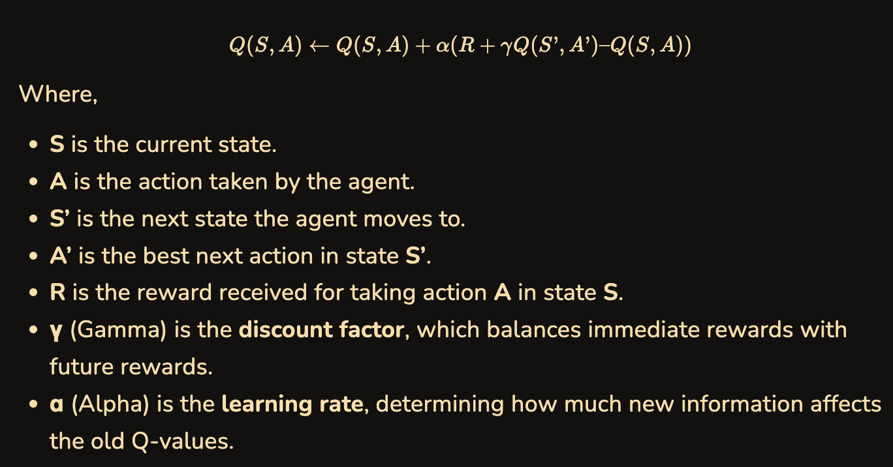
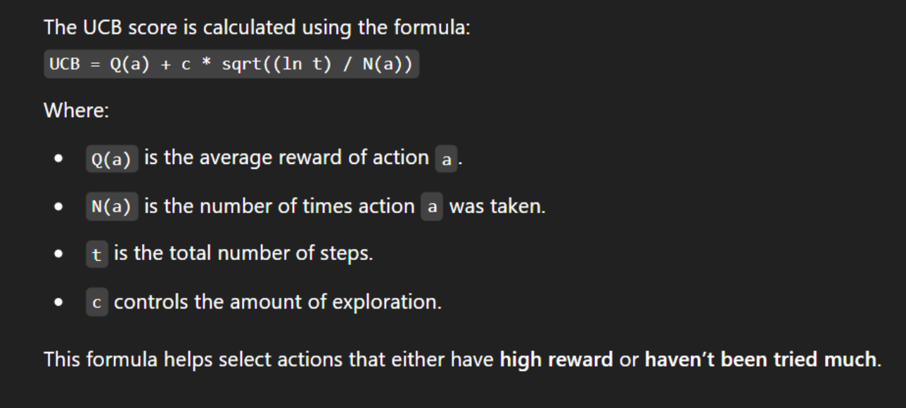
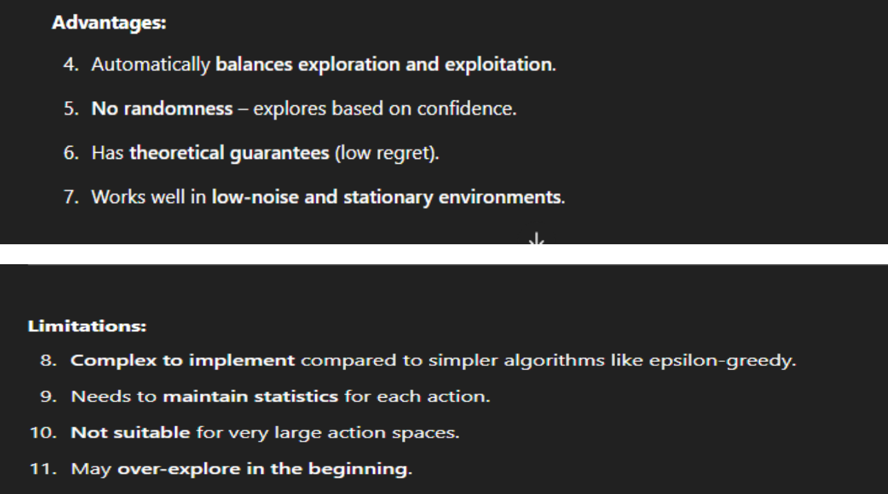
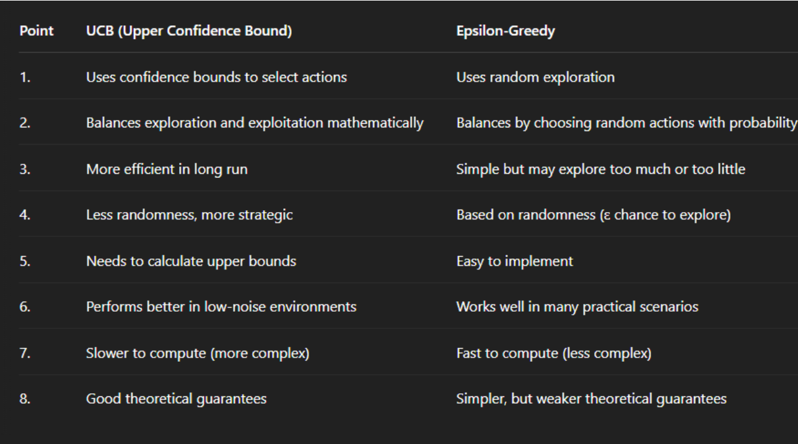
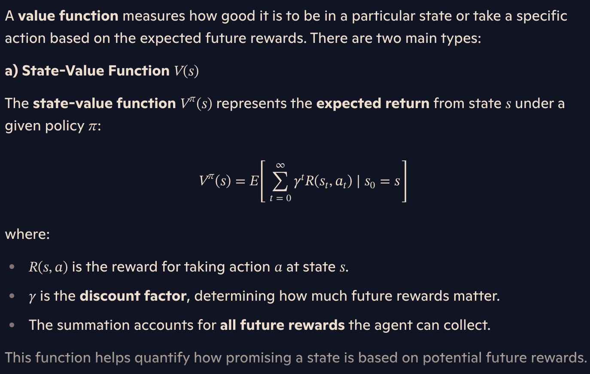
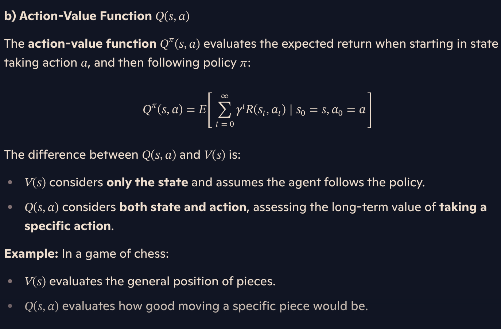
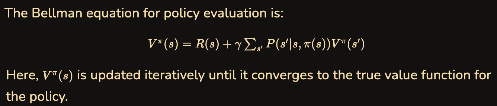
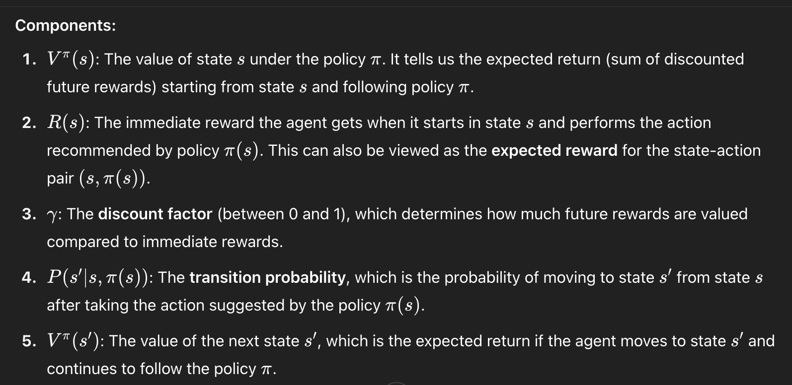
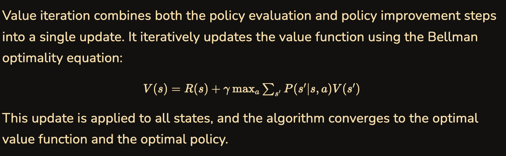

# Reinforcement Learning (RL)

# Introduction to Reinforcement Learning (04 Hours)

**1. Key features and elements of Reinforcement Learning (RL)**  
Reinforcement Learning is a type of machine learning where an agent learns to make decisions by interacting with an environment to maximize cumulative reward. The agent observes the state of the environment, takes actions, and receives feedback in the form of rewards.

- **Agent:** The learner or decision maker.
- **Environment:** The external system the agent interacts with.
- **State (s):** A representation of the current situation of the environment.
- **Action (a):** Choices the agent can make.
- **Reward (r):** Feedback from the environment for each action taken.
- **Policy (π):** The strategy that the agent employs to determine actions based on states.
- **Value Function (V):** Estimates the expected cumulative reward from a state.
- **Model (optional):** Predicts environment dynamics (used in model-based RL).

**2. Types of RL**  
- **Model-Free RL:** In Model-Free Reinforcement Learning, the agent learns directly from its interactions with the environment without constructing an explicit model of the environment's dynamics. This approach is particularly useful when the environment is complex or unknown, making it difficult to model accurately. Algorithms like Q-learning and SARSA fall under this category. These algorithms focus on learning the value of actions or state-action pairs based on the rewards received, allowing the agent to improve its policy through trial and error.

- **Model-Based RL:** Model-Based Reinforcement Learning involves the agent building an internal model of the environment's dynamics. This model is used to simulate the environment and plan future actions. The agent can predict the outcomes of actions and evaluate different strategies before executing them in the real environment. This approach can be more sample-efficient than model-free methods because it allows the agent to leverage the model for planning and decision-making. However, constructing an accurate model can be challenging, especially in complex environments.

- **On-Policy RL:** On-Policy Reinforcement Learning refers to methods where the agent learns the value of the policy it is currently following. This means that the agent updates its knowledge based on the actions it takes according to its current policy. SARSA (State-Action-Reward-State-Action) is a common on-policy algorithm. On-policy methods are beneficial when the goal is to improve the current policy directly, as they ensure that the learning process is consistent with the policy being evaluated.

- **Off-Policy RL:** Off-Policy Reinforcement Learning involves learning the value of an optimal policy independently of the actions taken by the agent. This allows the agent to learn from actions that are outside of its current policy, often using data generated by a different policy. Q-learning is a well-known off-policy algorithm. Off-policy methods are advantageous because they can utilize data from various sources, including past experiences or other agents, to learn an optimal policy, potentially speeding up the learning process and improving performance.

**3. Rewards**  
Rewards are scalar feedback signals received after taking actions. The goal of the agent is to maximize the total cumulative reward (return) over time. Rewards can be immediate or delayed, and their design is crucial for effective learning.

**4. Reinforcement Learning Algorithms**

- **Q-Learning:**
  is a model-free reinforcement learning algorithm used to train agents (computer programs) to make optimal decisions by interacting with an environment. It helps the agent explore different actions and learn which ones lead to better outcomes. The agent uses trial and error to determine which actions result in rewards (good outcomes) or penalties (bad outcomes).

  Over time, it improves its decision-making by updating a Q-table, which stores Q-values representing the expected rewards for taking particular actions in given states. The Q-table is essentially a memory structure where the agent stores information about which actions yield the best rewards in each state.
    - Structure of a Q-table:
      - Rows represent the states.
      - Columns represent the possible actions.
      - Each entry in the table corresponds to the Q-value for a state-action pair.

  Key Components of Q-learning
    1. Q-Values or Action-Values:
    represent the expected rewards for taking an action in a specific state. These values are updated over time using the Temporal Difference (TD) update rule.

    2. Rewards and Episodes:
    The agent moves through different states by taking actions and receiving rewards. The process continues until the agent reaches a terminal state, which ends the episode.

    3. Temporal Difference or TD-Update:
    The agent updates Q-values using the formula:
    

    4. ϵ-greedy Policy (Exploration vs. Exploitation):
    The ϵ-greedy policy helps the agent decide which action to take based on the current Q-value estimates:
        - Exploitation: The agent picks the action with the highest Q-value with probability `1–ϵ`. 
        This means the agent uses its current knowledge to maximize rewards.
        
        - Exploration: With probability ϵ, the agent picks a random action, exploring new possibilities to learn if there are better ways to get rewards. This allows the agent to discover new strategies and improve its decision-making over time.

    - Algorithm of Epsilon-Greedy
      - Initialize the estimated values of all arms to zero or a small positive number.
      - For each trial:
      - Generate a random number between 0 and 1.
      - If the number is less than ϵ, select a random arm (exploration). otherwise, select the arm with the highest estimated reward (exploitation).
      - Update the estimated reward of the selected arm based on the observed reward.

  - How does Q-Learning Works?
  Q-learning models follow an iterative process, where different components work together to train the agent, Steps of Q-learning:
    - Initialization: The agent starts with an initial Q-table, where Q-values are typically initialized to zero.
    - Exploration: The agent chooses an action based on the ϵ-greedy policy (either exploring or exploiting).
    - Action and Update: The agent takes the action, observes the next state, and receives a reward. The Q-value for the state-action pair is updated using the TD update rule.
    - Iteration: The process repeats for multiple episodes until the agent learns the optimal policy.

- **SARSA (State-Action-Reward-State-Action):**
  - SARSA is a model-free, on-policy reinforcement learning algorithm. Unlike Q-Learning, SARSA updates its Q-values based on the action actually taken by the current policy, making it an on-policy method. `The core idea of SARSA is to update the Q-value for each state-action pair based on the actual experience (i.e., what the agent does while following its policy). The Q-value is updated using the following Bellman Equation for SARSA: (above ☝️)`
  This means that the learning process is consistent with the policy being evaluated, as the agent learns from the actions it takes according to its current policy.
  - The update rule for SARSA is given by: `(above ☝️)`
  - Here, the parameters are similar to those in Q-Learning: \( \alpha \) is the learning rate, \( \gamma \) is the discount factor, and \( r \) is the reward. However, the key difference is that the next action \( a' \) is chosen according to the current policy, rather than being the action that maximizes the Q-value. This makes SARSA sensitive to the exploration strategy used, as it directly affects the actions taken and thus the learning process.

**Summary:**
Reinforcement Learning provides a framework for agents to learn optimal behaviors through trial and error, guided by rewards. Key algorithms like Q-learning and SARSA enable agents to learn value functions and policies for decision making in uncertain environments. 

# Bandit Problems and Online Learning (07 Hours)

## 1. n-Armed Bandit Problem
- **Definition:**  
  The n-armed bandit problem is a classic reinforcement learning scenario where an agent (or learner) is presented with a set of n actions (or "arms") and must repeatedly choose one action per time step. Each action yields a reward drawn from an unknown probability distribution. The agent's goal is to maximize its cumulative reward over time by balancing exploration (trying out new actions to gather information) and exploitation (choosing the action that currently seems best).

- **Key Concepts:**  
  - **Actions (Arms):**  
    The agent has n possible actions (for example, n slot machines).  
  - **Rewards:**  
    Each action (or "arm") yields a reward (for instance, a payout) drawn from an underlying (unknown) distribution.  
  - **Exploration vs. Exploitation:**  
    The agent must decide whether to explore (try new actions) or exploit (choose the action that has yielded the highest average reward so far).  
  - **Regret:**  
    Regret is the difference between the cumulative reward that would have been obtained if the agent always chose the best action (in hindsight) and the cumulative reward actually obtained. Minimizing regret is a common goal in bandit problems.

## 2. Action-Value Methods
- **Definition:**  
  Action-value methods are fundamental in reinforcement learning, allowing an agent to estimate the value of taking a specific action in a given state, typically with techniques such as Q-learning. These methods rely on maintaining and updating a value table or function that represents expected future rewards, thus enabling the agent to make informed decisions that maximize long-term benefits. By iteratively refining action-value estimates, agents can efficiently explore and exploit the environment to optimize their performance.

- Advantages
  - Model-free:	Don't need a model of the environment; learn directly from interactions.
  - Simple to implement:	Algorithms like Q-learning are relatively straightforward.
  - Off-policy learning possible:	Can learn from actions taken by a different policy (exploration vs. exploitation), which is useful for reusing experiences 
  - Discrete action spaces: Work well when the action space is small and discrete.
  - Exploration strategies are simple and easy to tune (e.g. ε-greedy).
  - Foundation for Deep Q-Networks (DQN)

- Disadvantage
  - Poor performance in continuous action spaces: You can't enumerate infinite actions; need to discretize or use actor-critic methods.
  - When using neural nets (like in DQNs), training can become unstable or diverge.
  - Simple exploration strategies (like ε-greedy) can be inefficient in complex environments.
  - Slow learning in large state spaces	Storing or learning Q-values for all state-action pairs scales poorly.
  - Not naturally stochastic:	Q-learning learns deterministic policies unless exploration is added manually.
  - Delayed learning of optimal policies: Needs to sample many state-action pairs multiple times to learn accurately.

## 3. Tracking a Nonstationary Problem
- **Definition:**  
  In a nonstationary bandit problem, the reward distributions for the actions change over time. This means that the best action at one time step may not remain the best later.

## 4. Optimistic Initial Values
- **Definition:**  
  Optimistic initial values is a technique used to encourage exploration early on. The agent initializes the estimated action values (Q-values) to a high (optimistic) value.  
- **How it works:**  
  - By setting high initial Q-values, the agent is more likely to try each action at least once (since the initial estimates are higher than the true expected rewards).  
  - As the agent gathers more rewards, the Q-values are updated (using, for example, the sample average or a recency-weighted update), and the agent gradually shifts from exploration to exploitation.  
- **Benefits:**  
  - Encourages thorough exploration of all actions early in the learning process.  
  - Can lead to faster convergence in stationary problems if the initial estimates are set appropriately.

## 5. Upper-Confidence-Bound (UCB) Action Selection
- **Definition:**  
  UCB is an action selection strategy that balances exploration and exploitation by considering not only the estimated action value but also the uncertainty (or confidence) in that estimate.  
- **UCB Formula:**  

- **Advantages / Limitations:**


- **Difference:**



**Applications of Bandit Problems and Online Learning:**
- A/B testing (e.g., in web design or marketing)
- Clinical trials (adaptive allocation of treatments)
- Recommendation systems (e.g., online ads, content recommendations)
- Resource allocation (e.g., dynamic channel allocation, job scheduling) 

# Markov Decision Processes (07 Hours)

## 1. The Agent–Environment Interface
- **Definition:**  
  The agent-environment interface is the fundamental framework of reinforcement learning. The agent-environment interface defines the loop of interaction that occurs over discrete time steps.
  - **📦 Interface Components**:
    - **Agent:** The learner and decision-maker
    - **Environment:** Everything outside the agent that it interacts with
    - **State (S):** A representation of the environment at a particular time
    - **Action (A):** The set of possible actions the agent can take
    - **Reward (R):** The feedback signal from the environment
    - **Transition Probability (P):** The probability of moving from state s to s' after taking action a
    - **Interaction Cycle:**
      1. Agent observes the current state (s)
      2. Agent selects an action (a)
      3. Environment transitions to a new state (s')
      4. Environment provides a reward (r)
      5. Process repeats

## 2. Goals and Rewards
- **Goal:**  
  The agent's objective is to maximize the cumulative reward over time.

- **Reward Hypothesis:**  
  All goals can be described by the maximization of expected cumulative reward.

- **Reward Design Principles:**
  1. Rewards should indicate what we want the agent to achieve
  2. Rewards should be informative about the goal
  3. Rewards should be scalar signals
  4. Rewards should be immediate (though they can be delayed)

- **Examples:**
  - Positive rewards for desired behaviors
  - Negative rewards (penalties) for undesired behaviors
  - Zero rewards for neutral states

## 3. Returns
- **Definition:**  
  The return (G) is the total discounted reward from time step t:

  G = R₁ + γR₂ + γ²R₃ + γ³R₄ + ...

  where:
  - G is the total return
  - R₁, R₂, R₃, etc. are the rewards at each time step
  - γ (gamma) is the discount factor (between 0 and 1)
  - Each future reward is multiplied by γ raised to the power of how many steps in the future it is

  In simpler terms, this means:
  - Immediate rewards (R₁) are valued at full value
  - Future rewards are worth less, with each step into the future reducing the value by a factor of γ
  - For example, if γ = 0.9:
    * A reward of 10 now is worth 10
    * A reward of 10 one step later is worth 9 (10 × 0.9)
    * A reward of 10 two steps later is worth 8.1 (10 × 0.9²)

## 4. Markov Properties
The Markov Property states that the future state of a system depends only on its present state, not on how it arrived at the present state. This means the system has no memory of its past states—its future behavior is determined solely by its current state.

Mathematically, if we define a sequence of states as S1, S2, S3 …, the Markov Property asserts that:
`𝑃(𝑆𝑡+1∣𝑆𝑡,𝑆𝑡−1,𝑆𝑡−2,… )=𝑃(𝑆𝑡+1∣𝑆𝑡)`
- where 
  - `𝑃` denotes probability and 
  - `𝑆𝑡` represents the state at time `𝑡`

## 5. Markov Decision Process (MDP)
`is a mathematical framework used for modeling sequential decision-making` in situations where outcomes are `uncertain`. An MDP consists of four key components:

1. States (S)
  A state represents the current condition or situation of the system. It captures all relevant information necessary for decision-making. States can be:
    - Discrete or Continuous: Discrete states have a finite set (e.g., different positions of a chess piece), whereas continuous states exist on a spectrum (e.g., speed of a car).
    - Observable or Partially Observable: In a fully observable MDP, the agent can always see the exact state. In partially observable settings (called POMDPs), the agent may have incomplete knowledge.
    - Examples: In self-driving cars, a state could be (current speed, position on road, presence of obstacles). In a chess game, a state is the arrangement of pieces on the board.

2. Actions (A)
  An action represents a decision the agent can take at any given state. The choice of action impacts future states and the overall reward. Actions can be:
    - Deterministic or Stochastic: Deterministic actions lead to a fixed outcome (e.g., moving a chess piece), while stochastic actions have unpredictable results (e.g., rolling a dice).
    - Continuous or Discrete: Continuous actions vary smoothly (e.g., adjusting steering angle), whereas discrete actions are limited to specific choices (e.g., moving up/down in a grid).
    - Examples: In a robotic arm, actions might include moving left/right. In a stock trading system, actions could involve buying, selling, or holding assets.

3. Transition Probability (P)
The transition probability function describes the likelihood of moving from the current state S to a new state S' after taking action A.

4. Reward Function (R)
The reward function assigns numerical values to each state-action pair, reflecting how desirable an action is. The goal of the agent is to maximize cumulative rewards over time. Rewards can be:
    - Immediate vs. Delayed: Some rewards are received instantly, while others depend on long-term outcomes.
    - Sparse vs. Dense: Sparse rewards occur infrequently (e.g., scoring a goal in soccer), while dense rewards are given frequently (e.g., keeping a car centered on a lane).
    - Examples: In a video game, collecting a coin might yield a reward of +10 points, while hitting an obstacle might give a -50 penalty.

## 6. Value Functions and Optimal Value Functions
  1. Value function: 
    - 
    - 

  2. Optimal Value Functions: An optimal value function represents the best possible outcome by following the optimal policy `𝜋∗`


**Applications of MDPs:**
- Robotics control
- Game playing
- Resource management
- Autonomous systems
- Decision making under uncertainty 

# Dynamic Programming (07 Hours)

## 1. Policy Evaluation (Prediction)
Policy evaluation is the process of computing the state-value function Vπ for a given policy π. It answers the question: "How good is it to follow policy π?"




## 2. Policy Iteration
Policy iteration is an iterative process of improving the policy based on the value function. It alternates between two steps:
  - Policy Evaluation: Evaluate the current policy by calculating the value function.
  - Policy Improvement: Improve the policy by choosing the action that maximizes the expected return, given the current value function.

  - **Algorithm:**
    1. Initialize policy π randomly
    2. Repeat until policy converges:
        - Policy Evaluation: Compute Vπ
        - Policy Improvement: Update π to be greedy with respect to Vπ
    3. Return optimal policy π*

The process repeats until the policy converges to the optimal policy, where no further improvements can be made.

## 3. Value Iteration


**Key Differences from Policy Iteration:**
- Combines evaluation and improvement steps
- Generally faster convergence
- More efficient for problems with many states
- Doesn't require explicit policy representation

## 5. Asynchronous Dynamic Programming (ADP) 
is a variation of traditional dynamic programming `where updates to value functions or policies are performed in a non-uniform, non-synchronous manner.` Instead of updating all states at once in a fixed order, ADP allows some states to be updated independently, without waiting for others. `Traditional dynamic programming follows a systematic, synchronous approach` where value updates happen uniformly across all states. However, in ADP, updates `can occur selectively—meaning certain states get updated more frequently based on their relevance or occurrence in the problem.`

### **Advantages of Asynchronous Updates in Dynamic Programming**

- Flexibility in Computation:
  - Allows updating only the most relevant or frequently visited states, reducing unnecessary computations.
  - Helps manage large-scale problems where updating all states simultaneously may be infeasible.

- Improved Computational Efficiency:
  - Reduces redundant updates for states that do not significantly contribute to policy improvement.
  - Faster convergence in cases where some states require frequent updates while others do not.

- Memory Optimization:
  - Asynchronous updates prevent unnecessary storage requirements by focusing only on key states.
  - Useful for large problems with high-dimensional state spaces, such as robotics or real-time decision-making.

- Handles Partially Observable Problems:
  - Works well in environments where only partial information about states is available.
  - Suitable for reinforcement learning applications, where updates are based on visited states rather than a predefined structure.

### **Disadvantages of Asynchronous Updates in Dynamic Programming**

- Loss of Consistency:
  - Since updates are non-uniform, some states may receive outdated or incomplete information, leading to inconsistent results.
  - Synchronization issues can arise when some states lag behind in updates.

- Complexity in Implementation:
  - Designing efficient asynchronous update mechanisms can be challenging.
  - Requires proper scheduling to ensure that important states are updated frequently.

- Dependence on Update Strategy:
  - The performance of ADP is highly dependent on the update scheduling policy—if poor scheduling is used, efficiency may decrease rather than improve.
  - Requires careful planning to prioritize valuable states effectively.

## 6. Generalized Policy Iteration (GPI)
- **Definition:**  
  GPI is a general framework where policy evaluation and policy improvement are done interactively.


## 7. Applications of Dynamic Programming in RL
- Game playing (chess, checkers)
- Robot navigation
- Resource allocation
- Inventory management
- Optimal control problems

**Limitations:**
1. Requires complete model of environment
2. Computationally expensive for large state spaces
3. Curse of dimensionality
4. Assumes discrete state and action spaces 

# Monte Carlo Methods and Temporal-Difference Learning (07 Hours)

## 1. Monte Carlo Prediction
Monte Carlo (MC) prediction is a `model-free` method in RL which learn directly from interaction with the environment, it is used to `estimate the value function` of a given policy using `averaged returns from sampled episodes.`

(`Note: In Reinforcement Learning (RL), an episode refers to a complete sequence of interactions between an agent and the environment, starting from an initial state and continuing until a terminal state is reached.`)

The Goal is To estimate the action-value function Q(s,a) or state-value function V(s), which represent the expected return (future cumulative reward) when starting from state s or taking action a in state s, and following the policy thereafter.

The key idea behind Monte Carlo estimation of action values is that we can compute the expected return
from a state-action pair by averaging the returns of episodes in which the agent starts in state s and takes
action a. The return is the total accumulated reward from that point onward until the episode terminates.
The Monte Carlo estimate of the action value Q(s, a) is updated incrementally using the following rule:

`Q(s, a) <- Q(s, a) + a (Gt - Q(s, a))`

  - Where:
    - Gt is the return (sum of rewards) from time step t onwards in the episode.
    - a is the step-size parameter, often called the learning rate.
    - Q(s, a) is the current estimate of the action value for state s and action a.

#### **Steps in MC Prediction**
1. Generate Episodes: Run full episodes by following a given policy.
2. Calculate Returns: For each visited state or (state, action) pair, compute the return Gt (sum of future
rewards).
3. Update Estimates: Update Q (s, a) or V (s) using the average of observed returns.
4. Repeat: Continue for many episodes to refine the estimates.

#### **Types of Monte Carlo Methods in RL**
There are different variations of the Monte Carlo method, depending on how they handle episode generation and state-action pair updates:

- **First-Visit Monte Carlo:** In this approach, we only update the action-value estimate for a state-action pair the first time it is visited in the episode. If a state-action pair is revisited within the same episode, we ignore subsequent returns for that pair.

- **Every-Visit Monte Carlo:** Here, the action-value estimate is updated every time a state-action pair is visited, even if it occurs multiple times in an episode.

- **On-policy MC:** The agent learns the action-value function for the policy it is following.

- **Off-policy MC:** The agent learns the action-value function for one policy while following a different policy (for example, by using a behavior policy that explores more).

#### **Advantages of Monte Carlo Estimation**
- Simplicity: The Monte Carlo method is conceptually simple and easy to implement.
- Model-free: It doesn't require a model of the environment, which is beneficial when the dynamics are unknown.
- Asymptotic Convergence: With sufficient exploration and enough episodes, the Monte Carlo method will converge to the true action-value function.

#### **Disadvantages of Monte Carlo Estimation**
- High Variance: The Monte Carlo method can have high variance, especially if the rewards are sparse or noisy. This can slow down learning.
- Need for Full Episodes: Monte Carlo methods require complete episodes to compute returns, which means it cannot update values during partial episodes.

#### **Key Characteristics:**
- Learn from complete episodes
- No model required
- Uses actual returns
- Only works for episodic tasks
- Updates after episode completion

## 2. Monte Carlo Control
- **Definition:**  
  MC control methods improve policies using MC estimation of action values.

- **Types of MC Control:**
  1. **MC Exploring Starts:**
     - Initialize Q(s,a) arbitrarily
     - Generate episodes using exploring starts
     - Update Q-values using MC estimation
     - Update policy to be greedy with respect to Q-values

  2. **On-policy MC Control (ε-greedy):**
     - Initialize Q(s,a) arbitrarily
     - Generate episodes using ε-greedy policy
     - Update Q-values using MC estimation
     - Update policy to be ε-greedy with respect to Q-values

- **Algorithm:**
  ```
  Initialize Q(s,a) arbitrarily
  Repeat forever:
      Generate episode using policy π
      For each state-action pair (s,a) in episode:
          Calculate return G
          Update Q(s,a)
      Update policy π to be greedy with respect to Q
  ```

## 4. TD Prediction
Temporal difference (TD) prediction is one of the core ideas in reinforcement learning (RL) and serves as a `bridge between Monte Carlo methods and dynamic programming`. At its heart, TD prediction aims to learn the `value function` that is, an estimate of how good it is to be in a particular state by `updating estimates based partly on existing estimates rather than waiting for a final outcome`. This process is known as bootstrapping, so TD learning updates `incrementally at each time step, rather than waiting for an entire episode to finish`.

`(Update the value function based partly on the existing estimates rather than waiting for entire episode to finish)`

#### How TD Prediction Works
TD prediction works by using the difference between successive estimates to improve the current value function. The update rule for the simplest form, TD(O), can be expressed as follows:

`V(s) <- V(s) + a [r + V(s') - V(s)]`

**where,**
- V(s) is the current estimate of the value of state s.
- r is the reward received after taking an action in state s.
- s' is the next state the agent transitions to.
- y (the discount factor) determines how future rewards are weighted relative to immediate rewards.
- a is the learning rate, deciding the extent to which new information overwrites old information.
- The term in the brackets, `δ = r + V(s') - V(s)`, is known as the `TD error` essentially `the prediction error of the current value estimate.` A non-zero TD error indicates that there was a discrepancy between the expectation (what V(s) predicted) and the reality (observed reward plus the estimated value of the next state).

#### Advantages of TD Prediction
- **Efficiency in Learning:** Since TD prediction updates online every timestep, it can learn from incomplete sequences without waiting for a full episode to terminate.
- **Reduced Variance:** Compared to Monte Carlo methods, which can exhibit high variance due to complete returns, TD methods tend to stabilize learning by smoothing out updates.
- **Versatile and effective:** for both episodic and continuing tasks, since it doesn’t require knowledge of the episode’s endpoint. Its online nature enables learning directly from each interaction with the environment.
- `Introduces some bias since future rewards are estimated rather than observed.` However, this approach generally has lower variance, making the update process more stable.
- **Model free**


**Monte Carlo prediction uses the full trajectory of rewards for an unbiased, but sometimes high-variance, update.**

**TD prediction leverages bootstrapping to update the value function immediately, trading off some bias for faster, lower-variance learning.**

**Applications:**
- Game playing
- Robot control
- Resource management
- Autonomous systems
- Real-time decision making

**Advantages of TD Learning:**
1. Online learning capability
2. Lower variance than MC methods
3. Works for both episodic and continuing tasks
4. More efficient than MC methods
5. Can learn from incomplete sequences

**Limitations:**
1. Bias in value estimates
2. Sensitive to learning rate
3. May not converge in non-Markov environments
4. Can be slower than model-based methods
5. Requires careful exploration strategy