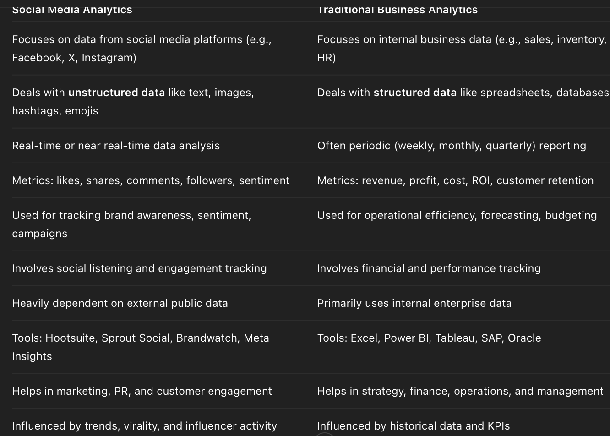

# Social Media Analytics (SMA)

## 1. Social Media Analytics: An Overview

### Core Characteristics of Social Media
- **User-Generated Content**: Content created and shared by users rather than organizations
- **Social Interaction**: Enables communication and interaction between users
- **Real-time Updates**: Instant sharing and updating of information
- **Accessibility**: Available across multiple devices and platforms
- **Global Reach**: Connects users worldwide
- **Multimedia Support**: Supports various content types (text, images, videos, etc.)
- **Network Effects**: Value increases with more users and interactions

### Types of Social Media
1. **Social Networks**
   - Facebook, LinkedIn, Twitter
   - Focus on connecting people and sharing content
   
2. **Content Sharing Platforms**
   - YouTube, Instagram, TikTok
   - Primarily for sharing media content
   
3. **Blogging Platforms**
   - WordPress, Medium, Tumblr
   - Long-form content sharing
   
4. **Professional Networks**
   - LinkedIn, ResearchGate
   - Career and professional development
   
5. **Discussion Forums**
   - Reddit, Quora
   - Topic-based discussions and Q&A

### Social Media Landscape
- **Platform Diversity**: Multiple platforms serving different purposes
- **User Demographics**: Varying user bases across platforms
- **Content Types**: Different formats and engagement patterns
- **Business Integration**: How organizations use different platforms
- **Emerging Trends**: New platforms and features
- **Cross-platform Integration**: How platforms interact and complement each other

### Need for Social Media Analytics (SMA)
1. **Business Intelligence**
   - Understand customer behavior
   - Track brand performance
   - Monitor market trends
   
2. **Competitive Advantage**
   - Identify market opportunities
   - Analyze competitor strategies
   - Improve decision-making
   
3. **Customer Insights**
   - Understand customer preferences
   - Track sentiment and feedback
   - Improve customer service

### SMA in Small & Large Organizations
Social Media Analytics (SMA) plays a crucial role in both small and large organizations, but the approach and impact differ significantly.

- Small Organizations
    - Cost-Effective Insights: Small businesses rely on free or affordable analytics tools to track engagement and audience behavior.
    - Customer-Centric Approach: SMA helps small businesses understand customer preferences and tailor content accordingly.
    - Competitive Analysis: Monitoring competitors' social media strategies allows small businesses to refine their own approach.
    - Agility & Quick Adaptation: Small organizations can swiftly adjust their strategies based on real-time analytics.

- Large Organizations
    - Advanced Analytics Tools: Large enterprises invest in sophisticated AI-driven analytics platforms for deeper insights.
    - Cross-Platform Benchmarking: They compare performance across multiple social media channels to optimize engagement.
    - Data-Driven Decision Making: SMA informs marketing strategies, product launches, and customer service improvements.
    - Brand Positioning & Reputation Management: Large organizations use SMA to track sentiment analysis and manage their brand image.

### Purpose of Social Media Analytics
1. **Performance Measurement**
   - Track engagement metrics
   - Measure campaign effectiveness
   - Monitor ROI
   
2. **Strategic Planning**
   - Identify trends and patterns
   - Inform business decisions
   - Develop marketing strategies
   
3. **Customer Understanding**
   - Analyze customer behavior
   - Track sentiment
   - Improve customer experience

### Social Media vs. Traditional Business Analytics

1. **Data Characteristics**
   - Social Media: Unstructured, real-time, user-generated
   - Traditional: Structured, historical, organization-generated
   
2. **Analysis Methods**
   - Social Media: Text mining, sentiment analysis, network analysis
   - Traditional: Statistical analysis, financial metrics, sales data
   
3. **Insights Type**
   - Social Media: Behavioral, emotional, social
   - Traditional: Financial, operational, transactional

### Seven Layers of Social Media Analytics
1. **Data Collection Layer**
   - Gathering raw social media data
   - API integration
   - Data storage
   
2. **Data Processing Layer**
   - Data cleaning
   - Format standardization
   - Data transformation
   
3. **Data Analysis Layer**
   - Statistical analysis
   - Pattern recognition
   - Trend identification
   
4. **Data Visualization Layer**
   - Dashboard creation
   - Report generation
   - Visual representation
   
5. **Insight Generation Layer**
   - Pattern interpretation
   - Trend analysis
   - Recommendation development
   
6. **Decision Support Layer**
   - Strategy formulation
   - Action planning
   - Resource allocation
   
7. **Implementation Layer**
   - Strategy execution
   - Performance monitoring
   - Feedback integration

### Types of Social Media Analytics
- **Descriptive Analytics** – Answers the question "What happened?" by summarizing past performance using metrics like likes, shares, comments, and follower growth.
    - Examples: Number of likes, shares, followers, impressions, engagement rates.
    - Tools: Facebook Insights, Twitter Analytics, Instagram Insights.

- **Diagnostic Analytics** – Explores "Why did it happen?" by analyzing patterns and correlations to identify the reasons behind engagement fluctuations.
    - Examples: Analyzing why a campaign underperformed by reviewing posting time, content type, or audience reaction.
    - Tools: Google Analytics (combined with social data), Sprout Social, Hootsuite Analytics.

- **Predictive Analytics** – Forecasts "What will happen?" using historical data and AI models to predict future trends, audience behavior, and engagement levels.
    - Examples: Predicting which types of posts will generate more engagement; identifying potential viral content.
    - Tools: Socialbakers, IBM Watson, Brandwatch.

- **Prescriptive Analytics** – Provides "What should be done?" recommendations based on data insights to optimize content strategies and improve engagement.
    - Examples: Suggesting optimal posting times, content types, or channels for future campaigns.
    - Tools: AI-powered platforms like Sprinklr, Salesforce Social Studio.

- **Sentiment Analysis** - What it does: Assesses the emotional tone behind social media mentions.
    - Examples: Measuring whether user comments are positive, neutral, or negative.
    - Tools: Brandwatch, Lexalytics, Talkwalker.

### Social Media Analytics Cycle

- **Planning** – Set clear objectives and define what success looks like.
- **Listening** – Monitoring conversations, trends, and audience sentiment across social media platforms.
- **Collecting Data** – Gathering relevant metrics such as engagement rates, follower growth, and content performance.
- **Analyzing** – Interpreting the data to identify patterns, trends, and areas for improvement.
- **Engaging** – Using insights to refine content strategies and interact meaningfully with the audience.
- **Optimizing** – Adjusting campaigns and strategies based on analytics to improve reach and impact.
- **Measuring Impact** – Evaluating the effectiveness of changes and tracking long-term performance.

### Challenges to Social Media Analytics
1. **Data Volume**
   - Handling large datasets
   - Processing speed
   - Storage requirements
   
2. **Data Quality**
   - Noise and spam
   - Incomplete data
   - Data accuracy
   
3. **Privacy Concerns**
   - Data protection
   - User consent
   - Regulatory compliance
   
4. **Technical Limitations**
   - API restrictions
   - Platform changes
   - Tool limitations

### Social Media Analytics Tools
1. **Monitoring Tools**
   - Hootsuite
   - Buffer
   - Sprout Social
   
2. **Analytics Platforms**
   - Google Analytics
   - Brandwatch
   - Socialbakers
   
3. **Visualization Tools**
   - Tableau
   - Power BI
   - D3.js
   
4. **Specialized Tools**
   - Sentiment analysis tools
   - Network analysis software
   - Competitor analysis platforms

## 2. Social Network Structure, Measures & Visualization

### Basics of Social Network Structure
- Nodes: Represent individuals, organizations, or entities in a network.
- Edges: Connections between nodes, representing relationships or interactions.
- Ties: The nature of relationships between nodes, which can be strong or weak.

#### Key Network Measures
- Degree Distribution – Measures the number of connections each node has, helping identify influential nodes.
- Density – Represents how interconnected the network is, calculated as the ratio of actual connections to possible connections.
- Connectivity – Determines how easily information flows through the network.
- Centralization – Identifies dominant nodes that control interactions within the network.
- Tie Strength – Measures the intensity of relationships, distinguishing between strong and weak ties.
- Trust – Evaluates the reliability and credibility of connections within the network.

### Common Network Terminologies
1. **Basic Terms**
   - Node/Vertex: Network entity
   - Edge/Link: Connection between nodes
   - Path: Sequence of connected nodes
   - Cycle: Path that returns to start
   
2. **Advanced Terms**
   - Clique: Fully connected subgraph
   - Component: Connected subgraph
   - Bridge: Critical connection
   - Cut point: Node whose removal disconnects network
   
3. **Analytical Terms**
   - Centrality measures
   - Clustering coefficients
   - Network motifs
   - Community detection

### Network Analytics Tools
1. **General Purpose Tools**
   - Gephi
     - Open-source visualization
     - Network analysis
     - Dynamic graphs
   - Cytoscape
     - Biological networks
     - Custom plugins
     - Advanced visualization
   
2. **Social Media Specific Tools**
   - NodeXL
     - Social media integration
     - Basic analysis
     - Visualization
   - Netlytic
     - Text analysis
     - Network mapping
     - Sentiment analysis
   
3. **Programming Libraries**
   - NetworkX (Python)
     - Network analysis
     - Algorithm implementation
     - Data structures
   - igraph (R/Python)
     - Graph algorithms
     - Visualization
     - Statistical analysis
   
4. **Commercial Tools**
   - Brandwatch
     - Social listening
     - Network analysis
     - Sentiment tracking
   - Sprinklr
     - Social media management
     - Network insights
     - Campaign analytics

## 3. Social Media Text, Action & Hyperlink Analytics

### Social Media Text Analytics

Text analytics, often referred to as text mining, is a sophisticated process that involves extracting valuable and actionable insights from unstructured text data prevalent on social media platforms. This process is crucial because social media is a rich source of textual data, including posts, comments, tweets, and captions, which are generated by users in real-time. The primary goal of text analytics is to transform this vast amount of raw text into structured information that can be analyzed to understand various aspects such as public sentiment, emerging trends, and user behavior.

The process of text analytics involves several key steps. Initially, it requires the collection of text data from various social media platforms, which can be achieved through APIs, social listening tools, or web scraping, while ensuring ethical considerations are met. Once the data is collected, it undergoes preprocessing, where the text is cleaned by removing irrelevant elements like special characters, emojis, and URLs, and is then prepared for analysis through techniques such as tokenization and lemmatization.

After preprocessing, the text is converted into a numerical format using methods like Bag of Words, TF-IDF, or advanced word embeddings such as Word2Vec and BERT, which allow for more nuanced analysis. Finally, various analytical techniques are applied to the structured data to extract insights. These techniques can include sentiment analysis to gauge public opinion, trend detection to identify viral topics, and brand monitoring to understand how a brand is perceived by the public. Through these detailed processes, text analytics provides organizations with the ability to make informed decisions based on the rich, unstructured data available on social media platforms.

Since much of the data on social media is in the form of text (posts, comments, tweets, captions, etc.), text analytics is crucial for understanding public opinion, trends, sentiments, and behaviors.

1️⃣ Types of Social Media Text
Social media generates diverse forms of text, which vary by platform and context. Key types include:

        Type	                                        Description	Examples
        Posts	                User-generated content shared on a timeline or feed	Tweets, Facebook posts, LinkedIn updates
        Comments	            Replies or feedback under posts	Comments on Instagram or YouTube videos
        Captions	            Text accompanying media like photos or videos	Instagram photo captions, TikTok descriptions
        Hashtags	            Keyword phrases used to categorize or amplify topics	#ClimateChange, #ThrowbackThursday
        Mentions/Tags	        Referencing users or brands using @	"@Nike makes great running shoes"
        Direct Messages	        Private user-to-user conversations (when accessible)	Messenger, Instagram DMs (not typically publicly mined)
        Reviews/Testimonials	Feedback left by users about products or services	Facebook reviews, comments about customer service

#### 2️⃣ Purpose of Text Analytics in Social Media
Text analytics helps organizations derive meaning from large volumes of user-generated content. Main purposes include:
- ✅ Sentiment Analysis: Understand public opinion (positive, negative, neutral)
- ✅ Trend Detection: Identify emerging topics or viral issues
- ✅ Brand Monitoring: Track how people talk about a brand or product
- ✅ Customer Feedback Analysis: Collect insights to improve services/products
- ✅ Crisis Detection: Spot PR issues or customer dissatisfaction early
- ✅ Competitor Analysis: Compare customer perception with rivals
- ✅ Content Strategy: Inform content planning based on user interests

#### 3️⃣ Steps in Social Media Text Analytics
The process of analyzing text data from social media typically involves the following steps:

        1. Data Collection
        Gathering text data from platforms using:
        APIs (e.g., Twitter API)
        Social listening tools (e.g., Brandwatch)
        Web scraping (with ethical considerations)

        2. Text Preprocessing
        Cleaning the raw text to prepare it for analysis:
        Removing special characters, emojis, URLs
        Lowercasing
        Removing stop words (e.g., “and”, “the”)
        Tokenization (splitting text into words)
        Lemmatization/Stemming (reducing words to base form)

        3. Text Representation
        Converting text into numerical form for analysis:
        Bag of Words (BoW)
        TF-IDF (Term Frequency–Inverse Document Frequency)
        Word Embeddings (e.g., Word2Vec, GloVe, BERT)

        4. Text Analysis Techniques
        Sentiment Analysis
        Topic Modeling (e.g., LDA – Latent Dirichlet Allocation)
        Keyword Extraction
        Named Entity Recognition (e.g., extracting names, locations)
        Intent Detection (e.g., complaint, praise, question)

        5. Visualization and Reporting
        Presenting insights through:
        Word clouds
        Sentiment graphs
        Topic frequency charts
        Dashboards

        6. Actionable Insight Generation
        Turning the analysis into strategic decisions:
        Adjust content strategy
        Launch PR campaigns
        Improve product features based on feedback

4️⃣ Social Media Text Analysis Tools
        Many tools can help automate and simplify text analytics tasks. These fall into a few categories:

        ✅ All-in-One Social Media Analytics Tools
        Tool	Key Features
        Brandwatch	Advanced sentiment analysis, trend tracking
        Talkwalker	Visual insights, AI-powered analysis
        Sprinklr	Unified customer experience analytics
        Hootsuite Insights	Social listening + text analytics

#### Types of Social Media Text
1. **Short-form Content**
   - Tweets (280 characters)
   - Status updates
   - Comments
   - Direct messages
   
2. **Long-form Content**
   - Blog posts
   - Articles
   - Reviews
   - Forum discussions
   
3. **Structured Content**
   - Hashtags
   - Mentions
   - URLs
   - Emojis and symbols

#### Social Media Text Analysis Tools
1. **General Purpose Tools**
   - NLTK (Natural Language Toolkit)
   - spaCy
   - TextBlob
   - Stanford CoreNLP
   
2. **Commercial Platforms**
   - Brandwatch
   - Sprinklr
   - Brand24
   - Mention
   
3. **Specialized Tools**
   - Lexalytics (Sentiment Analysis)
   - MonkeyLearn (Text Classification)
   - RapidMiner (Text Mining)
   - IBM Watson (NLP)

### Social Media Action Analytics

**🔹 What is Action Analytics?**

Action analytics in the context of social media refers to the measurement and analysis of user behaviors and interactions — the actions users take when they engage with content or features. Instead of analyzing what users say (as in text or sentiment analytics), action analytics focuses on what they do, such as:
- Clicking a link
- Watching a video
- Sharing a post
- Following/unfollowing
- Making a purchase through a social post

These actions reflect user intent, interest, and engagement depth, offering valuable insights for marketers, advertisers, and product teams.

**🔹 Common Social Media Actions Tracked**
Here are typical user actions that can be tracked across social platforms:

        Category	                    Examples of Actions

        Engagement  Actions	    Likes, shares, retweets, comments, reactions
        Click-Based Actions	    Link clicks, hashtag clicks, profile clicks, ad clicks
        Consumption Actions	    Video views, time spent on content, story completions
        Conversion Actions	    Sign-ups, purchases, downloads (via social)
        Follower Activity	    Following/unfollowing pages, joining groups
        Behavioral Patterns	    Posting frequency, active times, device usage

**🔹 Why Is Action Analytics Important?**
It helps you:
- ✅ Understand which content or campaigns drive real engagement
- ✅ Identify call-to-action (CTA) effectiveness
- ✅ Optimize for conversion (sales, signups)
- ✅ Measure ROI on social campaigns
- ✅ Track user journey from social interaction to conversion
- ✅ Enhance user experience by analyzing interaction patterns
- ✅ Personalize content based on user behavior insights
- ✅ Improve targeting strategies for advertisements
- ✅ Detect and respond to negative user behaviors promptly
- ✅ Foster community growth by understanding follower dynamics

### 4. Social Media Hyperlink Analytics:
Social Media Hyperlink Analytics is a `comprehensive process that involves tracking, analyzing, and interpreting the performance of hyperlinks shared across various social media platforms.` This process is crucial for businesses, marketers, and content creators as it provides deep insights into how audiences interact with links. By examining hyperlink performance, organizations can gain a better understanding of audience behavior, such as `which links are clicked most frequently and which content drives the most engagement`. Additionally, `hyperlink analytics helps in assessing content reach by determining how far and wide a link has been shared and viewed across different social media channels`. Furthermore, it plays a significant role in evaluating engagement metrics, such as the number of clicks, shares, and comments a link receives. Conversion metrics are also a key focus, as hyperlink analytics can reveal how many users take desired actions, like making a purchase or signing up for a newsletter, after clicking a link. Overall, Social Media Hyperlink Analytics equips stakeholders with valuable data to optimize their strategies, enhance user engagement, and improve conversion rates.

**Types of Hyperlinks in Social Media:** These are the most common types of links shared or embedded in social media content:
- Direct URLs
Raw links to websites or web pages.
Example: `https://www.example.com`

- Shortened URLs
Compressed versions of long URLs using URL shortening services.
Often used to track click data.
Example: `https://bit.ly/3ExAmPl`

- Custom Branded Links
Branded short URLs that include a recognizable brand name or domain.
Example: `https://yourbrand.link/sale`

- UTM Parameter Links
URLs with tracking parameters (UTM tags) added to them.
Help track traffic sources and campaign performance in tools like Google Analytics.
Example: `https://example.com?utm_source=facebook&utm_medium=social&utm_campaign=spring_sale`

- Inbound Links (In-Links) – Links coming from external websites to your page, indicating credibility and authority.

- Outbound Links (Out-Links) – Links from your page to other websites, providing references or additional resources.

- Reciprocal Links – Mutual links between two pages, often used for partnerships or collaborations.

**Hyperlink Analytics Tools:** A number of tools and platforms are used to perform hyperlink analytics effectively:

      a. Bitly
      b. Google Analytics (with UTM tags)
      c. Hootsuite
      d. Buffer
      e. Sprout Social
      f. Rebrandly
      g. Facebook Pixel & Twitter Pixel

### 5. Location Analytics: 
Location analytics involves the `comprehensive process of gathering, examining, and interpreting data that is tied to specific geographical locations, often referred to as geospatial data`. This type of data can include information about where events occur, where users are located, or where transactions take place. By analyzing this data, businesses and organizations can uncover patterns, behaviors, and trends that are geographically significant.

`For instance, location analytics can reveal customer movement patterns in a retail store, identify high-traffic areas in a city, or track the spread of a phenomenon across different regions.` `These insights enable organizations to make informed, data-driven decisions that are sensitive to the geographical context, such as optimizing supply chain logistics, targeting marketing efforts to specific areas, or planning new store locations`. 
 
Ultimately, location analytics provides a spatial dimension to data analysis, enhancing the ability to understand and respond to the dynamics of where things happen.

Location analytics is a powerful tool used in social media, marketing, and urban planning, but it also raises significant privacy concerns.

**Sources of Location Data**

These are the key sources through which location data is collected:

      a. Mobile Devices & GPS
      Smartphones and GPS-enabled devices continuously provide real-time location data.
      Apps often collect this with user permission.

      b. Wi-Fi & Bluetooth Signals
      Location can be inferred from proximity to Wi-Fi routers or Bluetooth beacons (e.g., in-store tracking).

      c. IP Addresses
      Provides approximate location based on the network used.
      Less accurate but useful for regional analysis.

      d. Social Media Check-ins and Tags
      Platforms like Facebook, Instagram, and Twitter allow users to tag their location in posts.

      e. Point of Sale (POS) Systems
      Tracks the location of sales, useful for retail and franchise analytics.

      f. Geotagged Images and Videos
      Multimedia files with embedded GPS data can reveal user locations.

      g. Satellite & Remote Sensing Data
      Used in large-scale environmental, agricultural, or urban planning analytics.

**Location Analytics and Privacy Concerns**

Because location data is highly sensitive, privacy concerns are significant:

      a. Consent and Transparency
      Users must be informed and give consent for their location to be tracked.

      b. Data Anonymization
      Personal identifiers should be removed to protect user identities.

      c. Regulations
      Compliance with laws like GDPR, CCPA, and others that govern the use of location data.

      d. Data Retention and Security
      Companies must secure location data and avoid storing it longer than necessary.

      e. Misuse of Data
      Location data can reveal personal habits, routines, and whereabouts—raising risks if misused or breached.

**Privacy Concerns**

- Data Misuse: Companies may collect and sell location data without user consent, leading to privacy violations.
- Security Risks: Unauthorized access to location data can expose individuals to threats like stalking or identity theft.
- Regulatory Challenges: Governments are implementing stricter data protection laws to address concerns over location tracking.

**Location Analytics Tools:** 

      Google Maps Platform / Google Location Services
      Esri ArcGIS
      Tableau
      QGIS
      Carto
      Mapbox
      Foursquare / Placer.ai / SafeGraph

**Applications: Businesses use location analytics for targeted advertising, customer behavior analysis, and optimizing services.**

**Benefits: It enhances user experiences by providing personalized recommendations and improving navigation services.**

### 6. Types of Search Engines

Search engines can be categorized in several ways based on how they operate or the type of content they index.

      1. Crawler-Based Search Engines
      These use automated bots to scan websites, index content, and retrieve results.
      Examples: Google, Bing, Yahoo, Yandex, Baidu
      Features: Fast, comprehensive, frequently updated.

      2. Human-Powered Directories (Web Directories)
      These rely on human editors to review and categorize websites.
      Examples: Open Directory Project (DMOZ – now defunct), Yahoo Directory (discontinued)
      Features: High-quality entries but limited coverage and slower updates.

      3. Meta Search Engines
      These do not have their own index. Instead, they send queries to multiple other search engines and combine the results. Aggregate results from multiple search engines and display a combined list.
      Examples: Dogpile, MetaCrawler, Startpage
      Features: Broader results, less control over ranking.

      4. Vertical (Specialized) Search Engines
      These focus on specific types of content or industries.
      Examples:
      Academic: Google Scholar, Microsoft Academic
      Jobs: Indeed, Monster
      Travel: Kayak, Skyscanner
      Images: Google Images, TinEye

### 7. Search engine analytics: 
refers to the process of `collecting, analyzing, and interpreting data related to how users find and interact with a website through search engines.` It focuses on understanding user behavior, search performance, and how effectively a website ranks in search engine results pages. 

Search engine analytics is an essential part of Search Engine Optimization (SEO) and digital marketing. It provides insights into how well a website is performing in organic (non-paid) search results and helps identify opportunities for improvement. Search engine analytics also includes `analyzing search queries that bring users to a website, identifying the most effective content, understanding user intent, and tracking how changes to a website impact its visibility on search engines.` It involves tracking metrics such as:

- Organic traffic: The number of users who visit a website through unpaid search engine results.
- Click-through rate (CTR): The percentage of users who click on a website’s link after seeing it in the search results.
- Bounce rate: The percentage of visitors who leave the site after viewing only one page.
- Keyword rankings: The position of a website for specific search terms or queries.
- Conversion rate: How many visitors from search engines complete a desired action (e.g., purchase, sign-up).

Tools commonly used in search engine analytics include:

- Google Search Console: Provides data on search performance, indexing issues, and keyword rankings.
- Google Analytics: Tracks user behavior, traffic sources, and conversion paths.
- Bing Webmaster Tools: Similar to Google Search Console but for Bing.
- Third-party SEO platforms: Like SEMrush, Ahrefs, and Moz, which offer deeper insights into keyword performance, backlink analysis, and competitor research.

----

# 1. Collaborative-based recommendation: 
also known as collaborative filtering, is a popular technique used in recommender systems to suggest items to users based on the preferences and behaviors of other users. 

### Types of Collaborative Filtering: 

- **User-Based Collaborative Filtering:**
This method finds users who are similar to the target user and recommends items that those similar users have liked. ex: If User A and User B both liked movies X and Y, and User B also liked movie Z, then movie Z is recommended to User A.

- **Item-Based Collaborative Filtering:**
This method finds items that are similar to the items the target user has liked and recommends those similar items. ex: If User A liked movies X and Y, and movie Z is similar to movie X, then movie Z is recommended to User A.

### Steps Involved

- **Data Collection**:
Collect data on user interactions with items, such as ratings, purchases, or clicks.

- **Similarity Calculation**:
Calculate the similarity between users or items using metrics like cosine 
similarity, Pearson correlation, or Jaccard index.
- **Prediction**:
Predict the rating or preference a user might have for an item based on the 
similarities calculated.
- **Recommendation**:
Recommend the top-N items with the highest predicted ratings or preferences to the 
user.

# 2. Social Information Filtering:
refers to the `process of using social data such as likes, shares, comments, and user behavior to filter and recommend content.` It plays a central role in social media analytics, helping platforms personalize user experiences and extract insights from large volumes of user-generated content. Social Information Filtering uses the `behavior and preferences of users within a network to recommend content to others`. It is a `subtype of collaborative filtering`, where user interactions serve as implicit feedback. `Social Information Filtering (SIF) is a type of recommendation system that suggests items to users based on the preferences and behaviors of similar users within a social network.` `It leverages the idea that people's tastes and interests are often influenced by the tastes and preferences of those around them.` Essentially, SIF automates the process of "word-of-mouth" recommendations by analyzing the collective preferences of many users to personalize suggestions for each individual

### 🔹 Social Sharing in Social Media Analytics
Social sharing is the act of distributing content through social networks. It is a major signal in filtering and recommendation algorithms.

### Key Aspects:

- Virality Tracking: Analyzing how content spreads and identifying key influencers.
- Engagement Metrics: Shares are stronger signals of interest than views or likes.
- Topic Trends: Content with high sharing metrics often contributes to trending topics.
- Audience Segmentation: Understanding who shares what, and with whom, helps in clustering users for targeting or personalization.

### Example:
A tweet shared widely by tech influencers will likely surface in other users’ feeds—even if they don’t follow the original poster—due to social filtering algorithms that interpret shares as a strong positive signal.

# 3. Social media risk management: 

involves a structured approach to identifying, assessing, mitigating, and evaluating risks associated with social media usage. Here are the four key steps:

- Identify Risks – Recognizing potential threats such as reputational damage, security breaches, misinformation, and compliance violations.
- Assess Risks – Evaluating the likelihood and impact of each risk to prioritize which ones need immediate attention.
- Mitigate Risks – Implementing strategies to reduce risks, such as enforcing social media policies, monitoring content, and using security measures.
- Evaluate & Improve – Continuously reviewing risk management efforts to refine strategies and adapt to new threats.